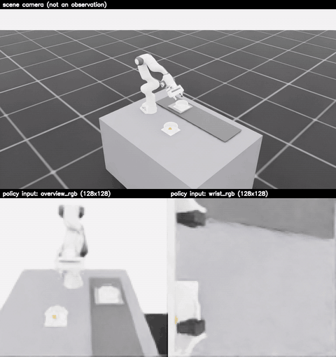

# food-robot

Isaac Lab environment of a robot arm placing food into bowls moving on a conveyor belt, runnable with TorchRL.

  

**Top:** scene camera showing the whole cell (for humans, not an observation). **Bottom:** what the policy
sees, the two camera observations at training resolution (128×128): `overview_rgb` (left) and `wrist_rgb`
(right). The arm follows a scripted motion, not a trained policy. [Full-resolution video](docs/media/training_setup.mp4)

- **Environment and all parameters:** [`docs/environment.md`](docs/environment.md)
- **Algorithms:** [`sota-implementations/`](sota-implementations/) (PPO first)

## Install

<b>Server / DGX Spark (Docker)</b> — recommended, verified

Requires Docker with the NVIDIA Container Toolkit and an NVIDIA GPU (≥ 16 GB VRAM recommended).

    ./docker/build.sh
    ./docker/run.sh python scripts/verify_install.py

The container runs as the non-root `isaaclab` user and keeps the Isaac Sim / Isaac Lab caches and generated
USD assets in named volumes (`docker/volumes.sh`). If a volume ever becomes unwritable, repair it with
`./docker/fix-volume-permissions.sh` (`build.sh` runs it automatically).

**Weights & Biases.** Training scripts log to W&B when `logger.backend=wandb`. On a server, put the API key in
`~/.netrc` (mode 600) — `docker/run.sh` mounts it read-only into the container — or export `WANDB_API_KEY`
before calling `docker/run.sh`:

    machine api.wandb.ai
      login user
      password <your-api-key>

<b>Local workstation (bare uv)</b> — untested

Development and all verification happened on the DGX Spark through Docker; this path has never been run
end-to-end. Requires an NVIDIA GPU (≥ 16 GB VRAM recommended).

    OMNI_KIT_ACCEPT_EULA=YES ./scripts/setup_env.sh
    source .venv/bin/activate

On aarch64, first install the build dependencies, and preload Isaac Sim's OpenMP/carb libraries before
starting Python:

    sudo apt install python3.12-dev libgl1-mesa-dev libx11-dev libxcursor-dev libxi-dev libxinerama-dev libxrandr-dev cmake build-essential
    export LD_PRELOAD=/lib/aarch64-linux-gnu/libgomp.so.1:.venv/lib/python3.12/site-packages/omni/client/libcarb.so

<b>Working from a laptop</b> — run everything on the server

`scripts/spark.sh` rsyncs the repo to the server and runs the command inside the container; `--host` runs
it on the server itself, and `--detach` starts it in a named background container.

    ./scripts/spark.sh --host ./docker/build.sh
    ./scripts/spark.sh python -m pytest tests/unit -q
    ./scripts/spark.sh --detach python sota-implementations/ppo/ppo.py env.num_envs=4096

`--detach` prints the container name and the commands to follow (`ssh spark docker logs -f <name>`) and
stop (`ssh spark docker stop <name>`) the run. Commands below are shown as run inside the container; prefix
them with `./scripts/spark.sh` from a laptop.

## Usage

| Task | Command |
|---|---|
| Inspect specs + random rollout | `python scripts/check_env.py env.num_envs=4 env.cameras=false env.privileged_information=true` |
| Train PPO | `cd sota-implementations/ppo && python ppo.py env.num_envs=4096` |
| Play a checkpoint | `cd sota-implementations/ppo && python play.py play.checkpoint=<path>/ppo_final.pt` |
| Render a video | `python scripts/render_episode.py out=outputs/render/episode.mp4 seconds=8` |
| Render a trained pixel policy | `python scripts/render_episode.py policy=<checkpoint>` |
| Unit tests (no simulator) | `python -m pytest tests/unit -q` |
| Simulator tests (slow) | `python -m pytest tests/isaac -q` |

Observation routing, measured throughput and play options: [`sota-implementations/ppo/README.md`](sota-implementations/ppo/README.md).
Rendering adds a wide scene camera (`render_camera=true`, not an observation) above the policy's camera
inputs; env overrides work as elsewhere, e.g. `env.belt.speed=0.12`.
