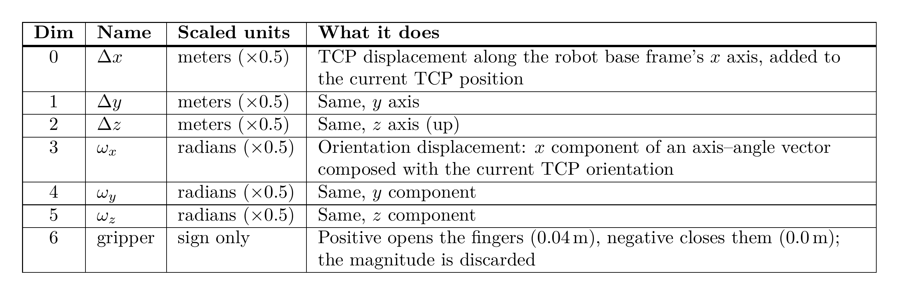
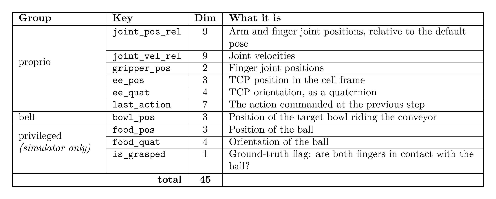
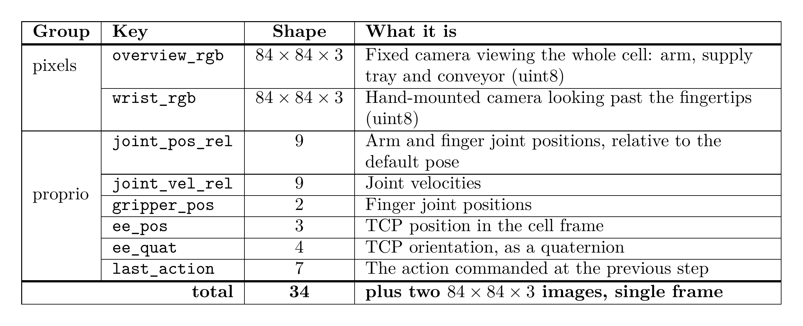

# pickplace

A simulated food-packing cell — a Franka arm picks an item from a supply tray and places it into bowls
riding a conveyor belt — built on **Isaac Lab 3** (PhysX) and trained with **TorchRL**.

The repository holds two things: the environment itself, with every parameter documented, and a staged
pipeline that trains a fast state-based teacher, records camera datasets from it, and distills those into
camera-based students with offline RL. The point of the staging is that only the *student's* inputs have to
exist on a real robot; the teacher may use simulator-only state, and the reward is scaffolding.

  

**Top:** scene camera showing the whole cell (for humans, not an observation). **Bottom:** the two camera
observations, `overview_rgb` (left) and `wrist_rgb` (right). The arm is following a scripted motion here, not
a trained policy. [Full-resolution video](docs/media/training_setup.mp4)

| | |
|---|---|
| **Environment reference** | [`docs/environment.md`](docs/environment.md) — layout, episode, observations, rewards, every config field |
| **Pipeline** | [`pipeline/`](pipeline/) — stage 0 teacher, stage 1 data, stage 2.1 offline RL |
| **Dataset** | [Sebasdi/pick-and-place-conveyor](https://huggingface.co/datasets/Sebasdi/pick-and-place-conveyor) — 3 tiers × 1 M frames, two 84 px cameras |
| **Online baselines** | [`sota-implementations/`](sota-implementations/) — PPO from state and from pixels |

## The task

One episode: a bowl enters the arm's reach zone on the belt, the arm picks the item out of the supply tray
and releases it into the moving bowl, then returns to its home pose — all before the bowl leaves the zone,
and without knocking the bowl over or off the belt. Success requires both the item settled in the bowl and
the tool back home. Control runs at 50 Hz.

The action space is the same for every policy in the repo:

The two observation sets are what the pipeline is about. The teacher reads privileged simulator state:

The students get only what a real cell could measure — two cameras and the robot's own proprioception. The
item and the bowl have to be found in the pixels:

The reward is simulator-only scaffolding — it shapes the teacher, and nothing in it has to exist on a real
robot. Ten active terms, with the weights forming a ladder along the task (1 → 2 → 5 → 10 → 20) so no stage
is ever worth lingering in:

The environment emits all 13 terms of its vocabulary **unweighted**, as a vector; a reward set
(`pickplace/reward_sets/*.yaml`) supplies the weights, and the recorded datasets store the vector — so a
dataset can be relabelled under a different reward without re-simulating anything.

## Pipeline

Each stage reads the previous stage's artifacts by path and writes its own with a JSON manifest, so any
stage can be re-run, swapped or branched. Artifacts live outside the repository under
`$FOOD_ROBOT_ARTIFACTS`.

| Stage | Folder | Produces |
|---|---|---|
| 0 · state teacher | [`pipeline/0_state_teacher/`](pipeline/0_state_teacher/) | PPO teacher on privileged state, 0.982 success over 1000 episodes, ~270 M frames/h at 32 k envs |
| 1 · collect data | [`pipeline/1_collect_data/`](pipeline/1_collect_data/) | Camera + state + action shards, one per teacher checkpoint and noise level |
| 2.1 · offline RL | [`pipeline/2_1_offline_rl/`](pipeline/2_1_offline_rl/) | BC / IQL / TD3+BC students on deployable observations, evaluated online |

## Results

Three algorithms, three seeds each, expert data only, both cameras plus proprioception, 100 k gradient
steps. Teacher reference under the same evaluation protocol: **0.984**.

| Algorithm | Best | Mean of last 5 evals | Steps to 0.90 | Wall clock |
|---|---|---|---|---|
| BC | 0.979 ± 0.008 | 0.944 ± 0.016 | **20 k ± 10 k** | **0.38 h** |
| IQL | **0.990 ± 0.012** | **0.956 ± 0.011** | 27 k ± 15 k | 1.22 h |
| TD3+BC (`alpha 0.025`) | 0.958 ± 0.008 | 0.919 ± 0.019 | 63 k ± 5 k | 0.83 h |

Three findings, each with the caveat that matters:

- **Proprioception, not vision, was the bottleneck.** Image-only students plateau around 0.82; adding the
  34-dim proprio vector reaches the teacher's level. Simulator-only object state on top adds nothing.
- **On clean expert data, cloning is enough.** Re-evaluated at 1000 episodes: teacher 0.982, BC 0.983
  (indistinguishable, z = −0.17), IQL 0.947 (significantly *worse*, z = 4.23). The data was recorded from a
  deterministic teacher with zero action noise, so a critic sees almost no action diversity to exploit.
- **The ranking inverts in production.** In the continuous demo — bowls arriving endlessly, scripted homing
  between cycles — IQL places 24 items with 0 misses while BC places 12 with 11 missed. Episodic success
  does not predict line throughput, and a [robustness
  sweep](pipeline/2_1_offline_rl/README.md#robustness-to-degraded-observations) over 17 degraded-sensor
  conditions does not explain the inversion either.

Full tables, per-seed numbers, the parked CQL investigation and the robustness study:
[`pipeline/2_1_offline_rl/README.md`](pipeline/2_1_offline_rl/README.md).

## Install

Requires an NVIDIA GPU (≥ 16 GB VRAM recommended) and Docker with the NVIDIA Container Toolkit.

    ./docker/build.sh
    ./docker/run.sh python scripts/verify_install.py

`docker/run.sh` bind-mounts the repository, keeps the Isaac Sim / Isaac Lab caches in named volumes
(`docker/volumes.sh`), and mounts `$FOOD_ROBOT_ARTIFACTS_HOST` (default `~/food-robot-artifacts`) at
`/workspace/artifacts`. Every command below is written as run inside the container.

To log to Weights & Biases, export `WANDB_API_KEY` or put the key in `~/.netrc` (mode 600); `docker/run.sh`
mounts it read-only.

Bare install with uv, no Docker — untested end to end

    OMNI_KIT_ACCEPT_EULA=YES ./scripts/setup_env.sh
    source .venv/bin/activate

On aarch64, install the build dependencies first and preload Isaac Sim's OpenMP/carb libraries before
starting Python:

    sudo apt install python3.12-dev libgl1-mesa-dev libx11-dev libxcursor-dev libxi-dev libxinerama-dev libxrandr-dev cmake build-essential
    export LD_PRELOAD=/lib/aarch64-linux-gnu/libgomp.so.1:.venv/lib/python3.12/site-packages/omni/client/libcarb.so

## Usage

| Task | Command |
|---|---|
| Inspect specs + random rollout | `python scripts/check_env.py env.num_envs=4 env.cameras=false env.privileged_information=true` |
| Train the state teacher | `python pipeline/0_state_teacher/train.py` |
| Continuous "production line" demo | `python pipeline/0_state_teacher/demo.py checkpoint=<path>` |
| Collect a dataset shard | `python pipeline/1_collect_data/collect.py checkpoint=<path> frames=1_000_000` |
| Train an offline-RL student | `python pipeline/2_1_offline_rl/iql/train.py` |
| Train PPO (online baseline) | `python sota-implementations/ppo/ppo.py env.num_envs=4096` |
| Render a video | `python scripts/render_episode.py out=outputs/render/episode.mp4 seconds=8` |
| Unit tests (no simulator) | `python -m pytest tests/unit -q` |
| Simulator tests (slow) | `python -m pytest tests/isaac -q` |

Configuration is Hydra throughout, so any field can be overridden on the command line
(`env.belt.speed=0.12`, `env.reward_set=simple_v3b`, `seed=1`). Long runs are best started detached:

    DOCKER_DETACH=1 DOCKER_NAME=teacher ./docker/run.sh python pipeline/0_state_teacher/train.py

and stopped cleanly — final checkpoint and evaluation — with SIGTERM:

    docker exec teacher pkill -TERM -f "kit/python/bin/python3.*train.py"

## Layout

    pickplace/            the package: env config, MDP terms, reward sets, TorchRL wiring, offline-RL pieces
    pipeline/             staged training: 0 teacher, 1 data collection, 2.1 offline RL
    sota-implementations/ online baselines in TorchRL's layout (PPO from state and from pixels)
    scripts/              env checks, rendering, benchmarks, shard verification
    docker/               image, run wrapper, named volumes
    docs/                 environment reference, experiment reports, media
    tests/                unit tests (no simulator) and Isaac tests (slow)

## Reproducibility

All numbers in this repository were measured on an NVIDIA DGX Spark (GB10, 121 GB unified memory) with
Isaac Lab 3.0.0-beta2, TorchRL 0.14 and CUDA 13. Throughput figures scale with the GPU; success rates should
not. Every artifact carries a manifest with its git commit, resolved config and provenance — a student
manifest names the shards it trained on, and each shard names the teacher checkpoint and its SHA-256.

`scripts/spark.sh` is a convenience wrapper we used to sync a working tree to a remote training box and run
a command there inside the container; `SPARK_HOST` and `SPARK_DIR` point it at any host over SSH.
