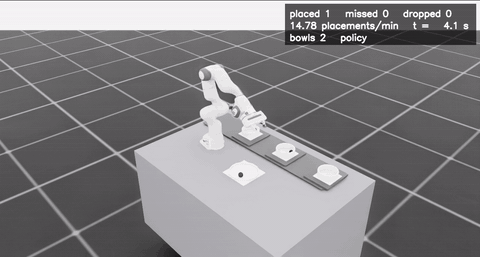

# pickplace

A simulated food-packing cell in **Isaac Lab 3**, trained with **TorchRL**: a Franka arm picks an item from
a supply tray and places it into bowls riding a conveyor belt, from two cameras and its own joint state.

  

The repository holds the environment and a three-stage pipeline: a fast state-based teacher, camera datasets
recorded from it, and camera-based students trained offline. Only the student's inputs have to exist on a
real robot, so the teacher may use simulator state and the reward is scaffolding.

| | |
|---|---|
| **Environment reference** | [`docs/environment.md`](docs/environment.md) |
| **Pipeline** | [`pipeline/`](pipeline/) · [teacher](pipeline/0_state_teacher/) · [data](pipeline/1_collect_data/) · [offline RL](pipeline/2_1_offline_rl/) |
| **Dataset** | [Sebasdi/pick-and-place-conveyor](https://huggingface.co/datasets/Sebasdi/pick-and-place-conveyor), 3 tiers × 1 M frames |
| **Results** | [`pipeline/2_1_offline_rl/README.md`](pipeline/2_1_offline_rl/README.md) |
| **Online baselines** | [`sota-implementations/`](sota-implementations/), PPO from state and from pixels |

## Setup

Requires an NVIDIA GPU (≥ 16 GB VRAM recommended) and Docker with the NVIDIA Container Toolkit.

    ./docker/build.sh
    ./docker/run.sh python scripts/verify_install.py

Every command below runs inside the container. Artifacts are written outside the repository, to
`$FOOD_ROBOT_ARTIFACTS_HOST` (default `~/food-robot-artifacts`), mounted at `/workspace/artifacts`.

Weights &amp; Biases, bare install without Docker, remote machines

Training logs to W&B when `logger.backend=wandb`. Export `WANDB_API_KEY` or put the key in `~/.netrc`
(mode 600); `docker/run.sh` mounts it read-only. `logger.backend=null` disables logging.

Without Docker (untested end to end):

    OMNI_KIT_ACCEPT_EULA=YES ./scripts/setup_env.sh
    source .venv/bin/activate

On aarch64, install the build dependencies first and preload Isaac Sim's OpenMP/carb libraries:

    sudo apt install python3.12-dev libgl1-mesa-dev libx11-dev libxcursor-dev libxi-dev libxinerama-dev libxrandr-dev cmake build-essential
    export LD_PRELOAD=/lib/aarch64-linux-gnu/libgomp.so.1:.venv/lib/python3.12/site-packages/omni/client/libcarb.so

To work from a laptop against a training machine, `scripts/spark.sh` rsyncs the tree over SSH and runs the
command there inside the container; `SPARK_HOST` and `SPARK_DIR` point it anywhere.

## Run the pipeline

    python pipeline/0_state_teacher/train.py --config-name config_v3c                  # teacher, ~2.5 h
    python pipeline/1_collect_data/collect.py checkpoint=<teacher.pt> frames=1_000_000  # dataset, ~6 min
    python pipeline/2_1_offline_rl/bc/train.py                                          # student, ~25 min

Swap `bc` for `iql` or `td3_bc`. Long runs are best started detached, and stopped with SIGTERM so a
final checkpoint and evaluation are still written:

    DOCKER_DETACH=1 DOCKER_NAME=teacher ./docker/run.sh python pipeline/0_state_teacher/train.py
    docker exec teacher pkill -TERM -f "kit/python/bin/python3.*train.py"

## Evaluate and render

    python pipeline/0_state_teacher/evaluate.py checkpoint=<teacher.pt> num_envs=1000
    python pipeline/2_1_offline_rl/evaluate.py checkpoint=<student.pt> num_envs=500
    python pipeline/0_state_teacher/demo.py checkpoint=<any.pt> seconds=120      # continuous production line
    python pipeline/2_1_offline_rl/render.py checkpoint=<student.pt> outcome=failure attempts=50

`demo.py video=false` returns the counts without rendering. `pipeline/2_1_offline_rl/robustness.py` sweeps
degraded observations, and `scripts/render_scene_stills.py` produces figures from the scene camera.

Changing the configuration

Everything is Hydra, so any field can be overridden on the command line:

    python pipeline/0_state_teacher/train.py env.num_envs=8192 env.belt.speed=0.12 optim.lr=1e-4
    python pipeline/2_1_offline_rl/iql/train.py seed=1 gradient_steps=50_000 data.shards=[expert_v3c]
    python pipeline/2_1_offline_rl/iql/train.py 'network.in_keys=[[pixels,overview_rgb],proprio]'

The reward is a 13-term vector weighted by a named reward set (`pickplace/reward_sets/simple_v3b.yaml`).
Select one with `env.reward_set=<name>` and override single weights with `+env.reward_weights.<term>=<value>`.
Datasets store the unweighted vector, so recorded data can be relabelled under a different reward without
re-simulating. Details in [`docs/environment.md`](docs/environment.md).

Stage configs live beside their scripts; `config_v3c.yaml` is the one that trained the published teacher,
and `--config-name` picks between them.

Tests and repository layout

    python -m pytest tests/unit -q      # no simulator, seconds
    python -m pytest tests/isaac -q     # launches Isaac Sim, slow

    pickplace/            env config, MDP terms, reward sets, TorchRL wiring, offline-RL pieces
    pipeline/             staged training: 0 teacher, 1 data collection, 2.1 offline RL
    sota-implementations/ online baselines in TorchRL's layout
    scripts/              env checks, rendering, benchmarks, shard verification
    docker/               image, run wrapper, named volumes
    docs/                 environment reference, experiment reports, media
    tests/                unit tests and Isaac tests

## License

MIT, see [LICENSE](LICENSE). The published dataset is CC BY 4.0. All numbers in this repository were
measured on an NVIDIA DGX Spark (GB10) with Isaac Lab 3.0.0-beta2, TorchRL 0.14 and CUDA 13.
