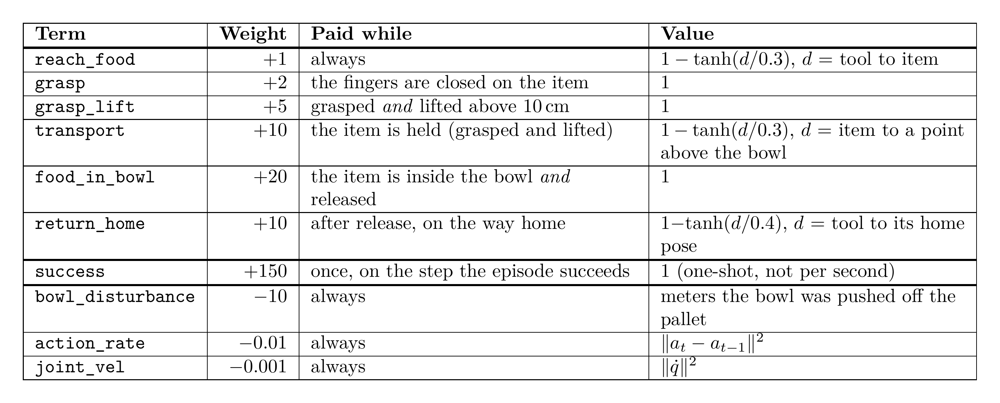

# Food cell environment

A robot arm stands next to a conveyor belt. Each episode one empty bowl rides the belt through the arm's
reach zone. The arm must pick a food item from the ingredient bowl and place it into the moving bowl before
the bowl leaves the zone — without knocking the bowl over or off the belt.

- Simulator: Isaac Lab 3 (PhysX), manager-based env, gym id `FoodRobot-Cell-v0`
- TorchRL: `pickplace.torchrl_env.make_env(cfg)` → `TransformedEnv(IsaacLabWrapper(...))`
- Control rate: 50 Hz (`sim.dt = 0.01`, `decimation = 2`)

## Layout (cell frame = env origin, meters)

```
 y
 ▲   belt (y = 0.30) ══[ entry ][======= reach zone =======][ exit ]══▶ x
 │                       bowl on a moving pallet
 │
 ●───────▶ x   Franka base at (0, 0, 0), table top at z = 0
 │
 │   ingredient bowl at (0.45, -0.10) with the food item
```

The table is a plain 1.5 m × 1.1 m box (top at z = 0) covering the robot base, the ingredient bowl and the
belt strip. The bowl rests freely on a pallet driven by a prismatic joint whose velocity equals the belt speed, so
friction carries the bowl (and food inside it) exactly like a real conveyor; the bowl can still be pushed,
tipped or knocked off.

## Episode

| Phase | What happens |
|---|---|
| Reset | robot joints ± 0.02 rad; ingredient bowl placed at a random position in `ingredient_bowl_x_range` × `ingredient_bowl_y_range`; food spawns inside it (± `food.spawn_range`); pallet starts at a random joint position in `belt.pallet_start_range`; belt speed = `speed · (1 + U(±speed_noise))` (noise 0 by default); bowl offset on the pallet sampled from `bowl_offset_x/y` |
| Running | bowl moves through the zone; the arm has ≈ `place_window` seconds |
| End | first termination below |

| Termination | Kind | Condition |
|---|---|---|
| `success` | terminated | food inside the bowl, released, at rest relative to the bowl for `success_settle_steps` steps |
| `bowl_exited_zone` | terminated | bowl passed the end of the reach zone (deadline missed) |
| `bowl_off_belt` | terminated | bowl below the pallet surface − 2 cm, or beyond the belt half-width |
| `bowl_tipped` | terminated | bowl tilted more than 45° |
| `food_off_table` | terminated | food below z = −5 cm |
| `time_out` | truncated | safety cap: `(entry_margin − pallet_start_range[0] − bowl_offset_x[0] + zone_length + 0.1) / (speed · (1 − speed_noise)) + 2 s` |

The zone exit is *terminated*, not truncated: the deadline is part of the task and the bowl position is
observed, so value targets must not bootstrap past it. `time_out` is a generous upper bound (the slowest
possible belt speed traversing the whole zone plus margin, plus 2 s of slack); in practice almost every
episode ends via one of the `terminated` conditions above well before `time_out` fires.

### Termination-fraction metrics

`episode_termination/<term>` (from `torchrl_env.termination_stats`, logged by `sota-implementations/ppo`)
reports, per termination term, the fraction of sub-envs whose *most recently finished* episode ended by
that term. Two things to keep in mind when reading it:

- A sub-env that has not yet finished any episode counts as 0 for every term (not excluded from the
  denominator), so early in training these fractions can look artificially low.
- Because it is a per-term fraction over the same set of sub-envs rather than a single categorical
  distribution, the fractions can sum to more than 1 if multiple terms have fired (for different
  sub-envs' most recent episodes) since the stat was last read.

## Observations

All groups are nested (`concatenate_terms=False`), so TorchRL keys look like `("proprio", "ee_pos")`.

| Group | Present when | Term | Shape (Franka) | Meaning |
|---|---|---|---|---|
| `proprio` | always | `joint_pos_rel` | 9 | joint positions minus defaults |
| | | `joint_vel_rel` | 9 | joint velocities minus defaults |
| | | `gripper_pos` | 2 | finger joint positions |
| | | `ee_pos` | 3 | tool center point position, cell frame |
| | | `ee_quat` | 4 | tool orientation (x, y, z, w) |
| | | `last_action` | 7 / 8 | previous action |
| `belt` | always | `bowl_pos` | 3 | bowl position, cell frame |
| `pixels` | `cameras=True` | `wrist_rgb`, `overview_rgb` | H×W×(3·frame_stack) | camera images from the `image_float` term: float32, values in [0, 255] (not normalized) |
| `privileged` | `privileged_information=True` | `food_pos` | 3 | food position, cell frame (simulation only) |
| | | `food_quat` | 4 | food orientation (simulation only) |
| | | `is_grasped` | 1 | 1.0 if the food is held (simulation only) |

`cameras=False` together with `privileged_information=False` is rejected: no observation would tell the
policy where the food is. Privileged terms are never available on a real robot — use them for critics,
teachers or debugging, not for deployable actors.

Belt speed is intentionally not observed: the line runs at a fixed speed.

#### Camera memory budget

`image_float` returns float32 (4 bytes/channel), 4x the native uint8 camera buffer (1 byte/channel),
because Isaac Lab's `ManagerBasedRLEnv` always declares observation spaces as float32 (see the term's
docstring in `pickplace/envs/mdp/observations.py`). TorchRL additionally stores one copy of every
observation at the root of a transition and one at `"next"`, so each camera term costs roughly:

```
bytes_per_frame ≈ n_cams × H × W × 3 × frame_stack × 4     (root)
bytes_per_frame ≈ n_cams × H × W × 3 × frame_stack × 4     (next)
total ≈ num_envs × 2 × n_cams × H × W × 3 × frame_stack × 4 bytes, per buffered transition
```

With the default two cameras (`wrist_rgb`, `overview_rgb`) at `image_size=(128, 128)`: `2 × 128 × 128 ×
3 × 4 = 393,216` bytes/env for one copy, so `≈ 786 KB/env` for root + next per transition held in the
collector/replay buffer (before accounting for `frames_per_batch` rollout steps buffered at once).
Multiply by `frames_per_batch = num_envs × collector.rollout_steps` to get the buffer's peak size, e.g.
at `rollout_steps=24` that is `≈ 18.9 MB/env` per PPO iteration's buffer.

With frame_stack=3 every number above triples; storing pixels as uint8 in the replay buffer (as
sota-implementations/ppo/ppo_pixels.py does) divides it by 4.

On a 128 GB unified-memory machine, leaving headroom for PhysX/rendering buffers and the network, a
reasonable starting range with both default cameras at 128×128 is `num_envs` in the low hundreds to
~1000 for camera-observing policies (`cameras=True`); the privileged/state-only teacher setup
(`cameras=False`) has no such constraint and is what the `sota-implementations/ppo/README.md` scale run
uses at `num_envs=4096`. `sota-implementations/ppo/ppo.py` also drops the `"next"` sub-tensordict before
it reaches the replay buffer (`ClipPPOLoss` only needs root observations, action, log-prob, advantage
and value_target), which roughly halves the buffered camera memory versus the naive formula above.

## Actions

| `action_mode` | Arm part | Gripper | Franka dim |
|---|---|---|---|
| `ee_delta_pose` (default) | differential IK, relative position (3) + axis-angle (3), scaled by `ik_action_scale` | binary: > 0 open, < 0 close | 7 |
| `joint_pos` | joint position offsets from defaults, scaled by `joint_action_scale` | binary | 8 |

`ee_delta_pose` has the same shape for every arm, so it is the portable choice.

The TorchRL action spec is unbounded (Isaac Lab declares no action limits), but actions are meant to lie in
[-1, 1]; the action terms multiply them by the arm's action scale. Squash policy outputs accordingly (the PPO
example uses a `TanhNormal` on [-1, 1]).

## Rewards

Isaac Lab multiplies each term by the step duration; one-shot terms are compensated so the episode return
changes by exactly the configured bonus/penalty.

| Term | Weight | Signal |
|---|---|---|
| `reach_food` | 1 | `1 − tanh(‖tcp − food‖ / 0.3)` |
| `grasp` | 2 | `grasped_mask` (0/1): fingers closed on the food, no lift needed -- a stepping stone toward `grasp_lift` |
| `grasp_lift` | 5 | food grasped and above z = 0.10 |
| `transport` | 10 | while grasped **and** held above z = 0.10 (same `lift_height` as `grasp_lift`): `1 − tanh(‖food − above(bowl)‖ / 0.3)` (moving target) |
| `transport_fine` | 5 | same with σ = 0.05 |
| `place_success` | +`success_bonus` (150) once | success termination |
| `bowl_failure` | −`bowl_failure_penalty` (150) once | bowl off belt or tipped |
| `food_dropped` | −`food_drop_penalty` (150) once | food off table |
| `bowl_disturbance` | −1 | distance the bowl was pushed from where the pallet carries it |
| `action_rate`, `joint_vel` | −1e-4 | regularization |
| `food_in_bowl` | 0 in `staged_v1` (20 in `simple_v2`) | food inside the bowl and released (the success termination's geometry, without its speed/settle test) |
| `return_home` | 0 before `simple_v3` (10 in `simple_v3`/`simple_v3b`) | while the food is released in the bowl: `1 − tanh(d / 0.4)`, `d` = TCP distance to its home pose |

Each one-shot penalty/bonus is deliberately large enough that ending an episode early is never more
profitable than a real attempt: dense shaping is non-negative, so early-ending never *gains* reward by
itself. With `grasp` added, the maximum dense shaping over a realistic zone traversal is ≈ 159 and holding the
bowl until `time_out` could reach ≈ 232 — but those are absolute ceilings, not the comparison that decides
behaviour. What matters is the *marginal* choice: a policy that stalls above the bowl instead of placing gains at
most ≈ 23/s × the ≈ 3.2 s left before `time_out` ≈ 74, while forfeiting the 150 success bonus, so placing always
wins; and deliberately dropping the food (−150 by default, −10 in run 3) is never rational, because doing
nothing instead costs only the tiny regularization terms. `pickplace/envs/cell_env_cfg.py` documents the
full anti-exploit argument next to the three constants, and asks you to re-check it whenever `belt.speed`,
`belt.speed_noise`, `belt.place_window` or the dense reward weights change.

The set that trained the teacher behind the published datasets is `simple_v3b`, with `success_requires_home`
on — placing alone no longer ends the episode, the tool has to come back:



### Reward-term vector and reward sets

`make_env` exposes every reward term, unweighted, as `("next", "reward_terms")` (shape `(N, 13)`) in
`pickplace.rewards.REWARD_TERMS` order: the dense terms `reach_food`, `grasp`, `grasp_lift`, `transport`,
`transport_fine`, `bowl_disturbance`, `action_rate`, `joint_vel`, `food_in_bowl`, `return_home`
(component = term value × dt, recovered from
Isaac Lab's reward manager) followed by the event terms `success`, `bowl_failure`, `food_dropped` (0/1, only
non-zero on the done row of an episode that ended that way, taken from `("next", "outcome", ...)`; `success`
is the Isaac Lab term `place_success`).

The training reward `("next", "reward")` is TorchRL's `LineariseRewards` over that vector: a weighted sum with
one weight per term. Weights come from a named reward set, `pickplace/reward_sets/<name>.yaml`, selected by
`env.reward_set` (default `staged_v1`, the table above) and overridden per term with
`env.reward_weights: {term: weight}` (e.g. the CLI override `+env.reward_weights.food_dropped=-10.0` — the
`+` is required because the `sota-implementations/ppo` configs do not define the key, and Hydra's struct mode
rejects adding an absent key without it). Dense weights are reward per second the term is held; event weights
are the one-shot bonus (positive) or penalty (negative). The legacy keys still work and resolve to the same
reward as before: `rewards` (dense terms only) and `success_bonus` / `bowl_failure_penalty` /
`food_drop_penalty` (when not null; penalties become negative weights), with `reward_weights` applied last
(`pickplace.torchrl_env.reward_weights(env_cfg)` returns the final weights). Isaac Lab itself keeps a
non-zero weight on every dense term (a zero-weight term would be skipped and vanish from the vector), so its
own logged `Episode_Reward/*` stats follow those forced weights, not the training ones: under a reward set
that zeroes a dense term, the `Episode_Reward/*` series for it (e.g. the `reach_food` health signal
`scripts/plot_training.py` plots) still describes a term the policy is not actually paid for.

Besides `episode_reward` (running sum of `reward`), `episode_reward_terms` is the per-term running sum of the
vector. Both reset on the done row under native auto-reset, so a finished episode's total is
`data["episode_reward_terms"] + data["next", "reward_terms"]`.

`transport`/`transport_fine` used to pay out on `grasped_mask` alone (food near the TCP, fingers stopped
between open and closed), with no lift required. Run 1 (27.8 M frames, see
`docs/experiments/ppo_pixels_run1/`) exploited this: the policy shepherded the food between its fingers on
the table to farm the weight-10 `transport` term instead of actually lifting it, and `grasp_lift` never rose
above noise. Task 13 gates both terms on the same `held = grasped & (food_z > lift_height)` condition
`grasp_lift` already used, so a non-grasp pays nothing.

## Parameters

Configure through constructor kwargs, e.g.
`FoodCellEnvCfg(cameras=False, privileged_information=True, belt=BeltCfg(speed=0.1))`, or through the
`env:` section of an algorithm's Hydra config.

The randomization ranges used for the first pixel PPO run are drawn to scale in
.

### `FoodCellEnvCfg`

| Parameter | Default | Description |
|---|---|---|
| `arm` | `FRANKA_CFG` | arm plug-in (`ArmCfg`) |
| `food` | `RigidFoodCfg()` | food plug-in (`FoodSourceCfg`) |
| `belt` | `BeltCfg()` | belt plug-in |
| `action_mode` | `"ee_delta_pose"` | `"ee_delta_pose"` or `"joint_pos"` |
| `cameras` | `True` | spawn wrist + overview cameras and add the `pixels` group |
| `image_size` | `(128, 128)` | camera height, width |
| `frame_stack` | `1` | camera frames stacked along channels per pixel observation (3 → H×W×9, oldest first); history resets per env |
| `privileged_information` | `False` | add the simulation-only `privileged` group |
| `ingredient_bowl_pos` | `(0.45, -0.10, 0.0)` | nominal ingredient bowl position (spawn pose; z is used at every reset) |
| `ingredient_bowl_x_range` / `ingredient_bowl_y_range` | `(0.45, 0.45)` / `(-0.10, -0.10)` | reset randomization of the ingredient bowl position (cell frame); degenerate (fixed) by default as of task 14 -- see "Supply tray" below. Validated against arm reach and belt clearance whenever non-degenerate |
| `supply_bowl` | `BowlGeometry(inner_radius=0.11, wall_height=0.015)` | ingredient container geometry; separate from `belt.bowl` as of task 14 -- see "Supply tray" below |
| `overview_cam_eye` / `overview_cam_target` | `(1.5, 0.1, 1.0)` / `(0.3, 0.1, 0.3)` | overview camera placement: in front of the table facing the robot head-on, centered between the ingredient bowl and the belt |
| `render_camera` | `False` | spawn `scene.render_cam`, a wide third-person camera for videos; not an observation, so the TorchRL specs don't change (the app must be launched with cameras enabled) |
| `render_cam_eye` / `render_cam_target` | `(2.3, -1.9, 1.9)` / `(0.3, 0.0, 0.35)` | render camera placement (whole cell in view) |
| `render_image_size` | `(720, 1280)` | render camera height, width |
| `success_bonus` | `150.0` | return added on success |
| `bowl_failure_penalty` | `150.0` | return subtracted when the bowl falls off or tips |
| `food_drop_penalty` | `150.0` | return subtracted when the food falls off the table (the pixel PPO run 3 config overrides this to `10.0` -- see `sota-implementations/ppo/config_pixels.yaml`) |
| `success_settle_steps` | `5` | consecutive at-rest steps required for success |
| `scene.num_envs` | `64` | parallel environments |

### `BeltCfg`

| Parameter | Default | Description |
|---|---|---|
| `speed` | `0.08` m/s | nominal line speed |
| `speed_noise` | `0.0` | per-episode relative noise: `speed · (1 + U(±noise))` |
| `place_window` | `5.0` s | time the bowl spends in the reach zone at nominal speed |
| `zone_center_x` | `0.45` m | zone center along the belt; zone length = `speed · place_window` |
| `belt_y` | `0.30` m | belt centerline |
| `belt_half_width` | `0.15` m | lateral limit for `bowl_off_belt` |
| `entry_margin` | `0.05` m | bowl spawns this far before the zone |
| `bowl_offset_x` | `(-0.02, 0.02)` m | reset randomization along the belt |
| `bowl_offset_y` | `(-0.04, 0.04)` m | reset randomization across the belt |
| `pallet_start_range` | `(-0.08, 0.08)` m | pallet joint position at reset (0 = belt entry); shifts when the bowl arrives: ~6.9 s (earliest) to ~4.4 s (latest) until it leaves the zone at 0.08 m/s |
| `plate_top_z` | `0.03` m | pallet surface height |
| `pallet_damping` | `1e4` | velocity-drive gain of the pallet joint |
| `bowl` | `BowlGeometry()` | inner radius 7 cm, wall 5 cm, mass 0.2 kg -- the **destination** bowl on the belt. Kept deep and narrow deliberately; the ingredient container is `FoodCellEnvCfg.supply_bowl`, a separate geometry as of task 14 (see "Supply tray" below) |
| `pallet` | `PalletGeometry()` | size `(0.22, 0.26, 0.01)` m, mass 2.0 kg, `travel_lower=-0.12`, `travel_upper=1.0` m — the prismatic joint's travel range along the belt; `travel_lower` must be ≤ `pallet_start_range[0]`. `travel_upper` must be ≥ `zone.length + entry_margin + 0.1` (the env raises `ValueError` otherwise), so the pallet can never run out of travel before the safety-cap `time_out`. |

The env raises `ValueError` if the zone endpoints are outside `arm.reach_radius`.

### `RigidFoodCfg`

The rigid-food plug-in owns everything food-specific: the asset, its startup material/mass
randomization, the per-reset `reset_food` event (pose randomization around the ingredient bowl), and the
`food_quat` privileged observation term — merged into the env's `EventCfg` / privileged observation group
by `FoodCellEnvCfg._build_events` / `_build_observations` (each term is `copy.deepcopy`'d, so one
`RigidFoodCfg` instance can be reused to build multiple envs).

| Parameter | Default | Description |
|---|---|---|
| `item_radius` | `0.02` m | sphere radius |
| `mass` | `0.03` kg | nominal mass |
| `static_friction_range` | `(0.6, 1.2)` | randomized once at startup per env |
| `dynamic_friction_range` | `(0.5, 1.0)` | randomized once at startup per env |
| `restitution_range` | `(0.0, 0.1)` | randomized once at startup per env |
| `mass_scale_range` | `(0.7, 1.3)` | mass scale, randomized once at startup per env |
| `spawn_range` | `0.06` m | ± xy food spawn randomization around the ingredient bowl center, applied by the `reset_food` event. Raised from 0.02 in task 14 alongside the wider, fixed supply tray -- see "Supply tray" below |

Raised in task 13 from `(0.3, 1.0)` / `(0.2, 0.8)`: the fingers otherwise spawn with no material of their
own and take PhysX's 0.5/0.5 default (see `ArmCfg.finger_friction` below), and with the combine mode unset
(averaged), the old range's low end left the effective dynamic coefficient as low as ~0.35 against a smooth
4 cm sphere gripped by flat pads. Those values were chosen before the grasp was physically possible at all
(task 13's own probe never got the gripper to the food -- see "Supply tray" below), so they were unvalidated
guesses. Task 14's friction sweep (`scripts/probe_grasp.py friction_sweep=0.3,0.6,1.0,1.4`), run once the
grasp actually worked, is the first one that measures anything real; see task-14-report.md for the table and
verdict on whether `(1.2, 1.0)` / `(0.6, 1.2)` / `(0.5, 1.0)` are justified.

### Supply tray (fixed in task 14; was mis-diagnosed as a reach limit in task 13)

The scripted grasp used to fail 0% of the time, and the previous agent's conclusion ("kinematically
unreachable") was wrong. task-13-debug-report.md measured two independent, stacked defects:

1. **The probe never commanded end-effector orientation** (`scripts/probe_grasp.py`'s `action[:, 3:6]` stayed
   zero). In relative-mode IK a zero rotation command means "do not correct", and the Franka's reset pose is
   ~44 deg off top-down, so the whole descent happened diagonally -- driving `panda_joint6` into its
   3.7525 rad hardware limit a few cm short of the food. This looked like a workspace limit but was not: task
   14 fixes it in the probe by computing, every control step, the axis-angle rotation that would align the
   hand's approach axis with straight down and feeding it back as the rotation command (see
   `_topdown_axis_angle_error` in `scripts/probe_grasp.py`); the debug report measured that this alone drops
   q6's peak to ~2.85 rad.
2. **The old ingredient bowl's rim was taller than the food.** With `inner_radius=0.07`/`wall_height=0.05`,
   the rim top sat at z=0.056 while the food's top was only at z=0.046 -- 1 cm higher. Even a perfectly
   vertical gripper bottomed its hand on the rim about 0.7 mm above the sphere's equator, closed on the
   widest point, and squeezed the food out sideways. This was the *hand body* fouling the rim, not the
   fingers fouling the wall (measured 2.2 cm of radial clearance for the fingers) -- widening the bowl alone,
   without lowering the rim, would not have fixed it.

Fix 1 is necessary but not sufficient by itself (it reaches the food but still can't grip it past the rim);
task 14 does both together:

- `FoodCellEnvCfg.supply_bowl: BowlGeometry(inner_radius=0.11, wall_height=0.015)` is a new, separate
  geometry used only for `scene.ingredient_bowl` and the food's spawn height. `belt.bowl` (the destination
  bowl on the belt) is untouched -- the two containers no longer share one `BowlGeometry` instance, which is
  also what let the bowl widen without tripping `validate_bowl_on_pallet` (that check is about the
  destination bowl's fit on the pallet, and never sees `supply_bowl`).
- The ingredient bowl's position is now fixed (`ingredient_bowl_x_range`/`_y_range` default to a single
  point, `(0.45, 0.45)`/`(-0.10, -0.10)`); the food is instead randomized inside the wider tray
  (`RigidFoodCfg.spawn_range` raised 0.02 -> 0.06 m), covering a comparable xy spread while removing one DR
  axis from the container itself. The range fields are kept (not collapsed to plain floats) so container
  position DR can be switched back on later.
- The food is now a dark forest green (`(0.001, 0.02, 0.003)`; note `diffuse_color` is in *linear* colour space,
  so under the scene lighting it displays far brighter than the numbers suggest — `(0.02, 0.28, 0.05)` still looked
  mid-green; brown `(0.55, 0.27, 0.07)` before task 14, and a lighter
  `(0.15, 0.60, 0.20)` during run 2, which rendered as a pale mint against the white tray), which separates it from the
  white robot, off-white bowls and grey table far better at low camera resolutions.

### `ArmCfg` (Franka defaults)

| Parameter | Default | Description |
|---|---|---|
| `arm_joint_names` / `gripper_joint_names` | `panda_joint.*` / `panda_finger_joint.*` | joint regexes |
| `gripper_body_names` | `["panda_leftfinger", "panda_rightfinger"]` | rigid bodies the `gripper_material` startup event applies `finger_friction` to |
| `ee_body_name` | `panda_hand` | end-effector body |
| `tcp_offset` | `(0, 0, 0.1034)` | tool center point offset |
| `gripper_open` / `gripper_closed` | `0.04` / `0.0` | finger joint targets |
| `finger_friction` | `(1.2, 1.0)` (static, dynamic) | applied to `gripper_body_names` by the `gripper_material` startup event (task 13); without it the fingers inherit PhysX's 0.5/0.5 default |
| `reach_radius` | `0.80` m | used for belt-zone validation |
| `ik_action_scale` / `joint_action_scale` | `0.5` / `0.5` | action scaling |

Adding an arm: create an `ArmCfg` with the arm's articulation configs, joint/body names, TCP offset and
wrist camera mount, and register it in `pickplace/config.py`. Observation and action specs follow
automatically.

The Franka's own asset path needs one workaround: `isaaclab_assets` (pinned at v3.0.0-beta2.patch1) still
points at `.../FrankaEmika/panda_instanceable.usd`, but the live Nucleus asset pack moved that file under a
`Legacy/` subpath. `pickplace/arms/franka.py` rewrites the path to
`.../FrankaEmika/Legacy/panda_instanceable.usd` (and raises loudly if neither path shape matches, so a
future Nucleus or `isaaclab_assets` change is caught instead of silently ignored).

### Hydra / plain-mapping config (`pickplace.config.build_cell_env_cfg`)

`build_cell_env_cfg` (used by `make_env` and every `sota-implementations/*` Hydra config's `env:` section)
merges a plain mapping over `DEFAULT_ENV` and builds the `FoodCellEnvCfg` above. In addition to the
constructor kwargs it forwards directly (`num_envs`, `arm`, `food`, `action_mode`, `cameras`, `image_size`,
`privileged_information`, `success_settle_steps`, `ingredient_bowl_pos`, `overview_cam_eye`,
`overview_cam_target`, `belt`, `seed`, `device`), it accepts:

| Key | Meaning |
|---|---|
| `reward_set` | Name of a reward set in `pickplace/reward_sets/` (or a path to a YAML file); default `staged_v1`. |
| `reward_weights` | `{term: weight}` overrides over the reward set; unknown term names raise `KeyError`. |
| `rewards` | Legacy: `{dense_term: weight}` overrides. Unknown or non-dense names (e.g. `place_success`) raise `KeyError`. |
| `success_bonus` / `bowl_failure_penalty` / `food_drop_penalty` | Legacy: when not null, set the `success` weight to `+value` and the `bowl_failure` / `food_dropped` weights to `-value`. |
| `food_params` | Forwarded as constructor kwargs to the food plug-in class (e.g. `{"spawn_range": 0.03, "mass": 0.04}` for `RigidFoodCfg`). |
| `belt.bowl` / `belt.pallet` | Nested dicts, turned into `BowlGeometry(**belt.bowl)` / `PalletGeometry(**belt.pallet)` before constructing `BeltCfg`, e.g. `{"belt": {"pallet": {"travel_upper": 2.0}}}`. |

Unknown top-level keys raise `ValueError` listing the allowed set (`DEFAULT_ENV`'s keys).

## TorchRL usage

```python
from pickplace.app import launch_app
app = launch_app(headless=True, enable_cameras=False)   # before importing torch

from pickplace.torchrl_env import make_env
env = make_env({"task": "FoodRobot-Cell-v0", "num_envs": 16, "cameras": False, "privileged_information": True})
td = env.rollout(10)
print(td["next", "proprio", "ee_pos"].shape)   # (16, 10, 3)
```

Route observations to model parts with `pickplace.keys.expand_in_keys(env.observation_spec, ["proprio", "belt"])`.
Inspect the spec tree: `python scripts/check_env.py env.cameras=false env.privileged_information=true`.

### Episode outcome

`make_env` adds an `EpisodeOutcome` transform. On a done row, `("next", "outcome", <term>)` is True for the
termination term(s) that ended the episode (`success`, `bowl_exited_zone`, `bowl_off_belt`, `bowl_tipped`,
`food_off_table`, `time_out`); it is False everywhere else. The success rate of a batch is therefore
`outcome.success[done].float().mean()` (see `pickplace.metrics.outcome_rates`), exact per finished episode,
unlike `termination_stats`, which only reflects each env's most recent episode.

## Training

See `sota-implementations/ppo/README.md`. Camera-trained checkpoints (`env.cameras=true`) must also be
played with `env.cameras=true`: `play.py` reads `env.cameras` from the CLI to launch the app before the
checkpoint's saved config is available, then raises a `ValueError` if the two disagree.
