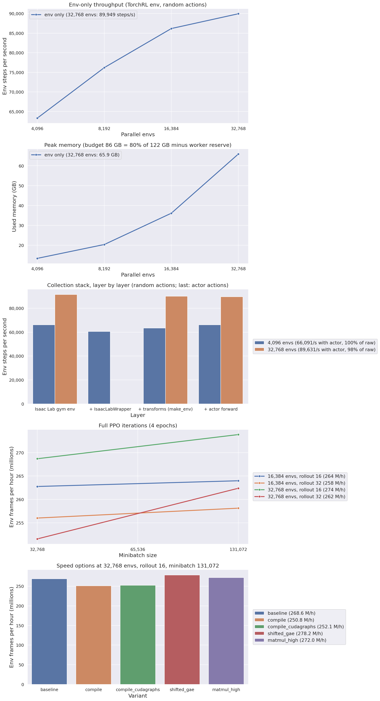

# State-teacher scaling benchmark

- Date: 2026-09-18. Code: `pipeline/0_state_teacher/benchmark.py` at 4f8bc4c (A rows and the 4,096-env split rows
  at d98db30, which has the same measuring code before the grid was trimmed).
- Machine: DGX Spark (NVIDIA GB10), 121.7 GB unified memory. Budget = 0.8 x 121.7 - 11 GB reserve = 86.4 GB. The
  reserve is for the teacher's background checkpoint worker (render 8.8 GB + eval 4.1 GB measured, not at the same time).
- Command: `./scripts/spark.sh --detach python pipeline/0_state_teacher/benchmark.py out=outputs/benchmark_state reserve_gb=11`
- Files: `benchmark.csv` (every row), `summary.json` (selection), `benchmark.png`.
- Wall-clock: 1 h 43 min. All rows `ok`, 0 PhysX errors, no memory-guard kills.

## Selected configuration (now in `pipeline/0_state_teacher/config.yaml`)

| | before | selected |
|---|---|---|
| `env.num_envs` | 4,096 | **32,768** |
| `collector.rollout_steps` | 24 | **16** |
| `loss.mini_batch_size` | 32,768 | **131,072** (4 minibatches per epoch) |
| `loss.shifted_gae` | false | **true** |
| frames per hour | ~160-167 M (measured in training) | **278 M** (+70%) |
| frames per batch | 98,304 | 524,288 |
| peak memory | 16 GB | 67.8 GB (+ worker ~9 GB) |
| 200 M frames | ~1.2 h | ~0.7 h |

Selection is on throughput only. **Bigger batches can change sample efficiency**: 200 M frames are now 381 PPO
iterations (6,096 gradient steps) instead of 2,034 iterations (24,408 gradient steps). Watch the first run with this
config against the 4,096-env run's curves (W&B run `zpk5xfwg`: eval return 3 -> 49 over 160 M frames). If it learns
clearly slower per frame, 16,384 envs x rollout 16 costs only 4% throughput (264 M/h) at half the batch; 4,096 envs
with `loss.shifted_gae=true` keeps the old batch size.

## Phase A: env only (TorchRL env, random actions, 300 steps)

| num_envs | env steps/s | peak GB | build s | PhysX errors |
|---:|---:|---:|---:|---:|
| 4,096 | 63,326 | 13.4 | 40 | 0 |
| 8,192 | 76,212 | 20.4 | 66 | 0 |
| 16,384 | 86,179 | 36.1 | 143 | 0 |
| 32,768 | 89,949 | 65.9 | 298 | 0 |

Throughput saturates: 8x the envs give 1.42x the steps/s. The simulator is the limit (the GPU ran at ~60%
utilisation at 4,096 envs; per-step cost is CPU-side PhysX/Isaac Lab work).

## Phase A2: where collection time goes

| layer | 4,096 envs | 32,768 envs |
|---|---:|---:|
| raw Isaac Lab gym env (`gym.make` + `step`) | 66,134 | 91,438 |
| + `IsaacLabWrapper` | 60,516 | - (trimmed) |
| + transforms (`make_env` TransformedEnv) | 63,326 | 89,949 |
| + actor forward (as the collector runs it) | 66,091 | 89,631 |

(env steps/s; run-to-run noise is about +-5%.) The TorchRL wrapper, transforms and the policy cost nothing measurable:
the transformed env with the actor runs at 98-100% of the raw gym env. In training, collection at 4,096 envs ran at
~53.7 k steps/s (the Collector's trajectory bookkeeping adds ~15% at that size); at 32,768 envs training collection
ran at 93-95 k steps/s, i.e. the overhead vanishes. Only more envs per step (or a cheaper simulation) makes
collection faster.

## Phase B: full `train.py` iterations (4 iterations, mean of iterations 2-4, 4 PPO epochs)

| num_envs | rollout | minibatch | frames/h | collect s | update s | peak GB |
|---:|---:|---:|---:|---:|---:|---:|
| 32,768 | 16 | 131,072 | **273.9 M** | 5.50 | 1.39 | 69.3 |
| 32,768 | 16 | 32,768 | 268.7 M | 5.55 | 1.48 | 70.0 |
| 16,384 | 16 | 131,072 | 264.0 M | 2.87 | 0.70 | 41.0 |
| 16,384 | 16 | 32,768 | 262.8 M | 2.85 | 0.74 | 40.0 |
| 32,768 | 32 | 131,072 | 262.4 M | 11.59 | 2.80 | 78.0 |
| 16,384 | 32 | 131,072 | 258.1 M | 5.93 | 1.40 | 44.0 |
| 16,384 | 32 | 32,768 | 256.0 M | 5.89 | 1.48 | 44.0 |
| 32,768 | 32 | 32,768 | 251.6 M | 12.07 | 2.98 | 79.6 |

Phase B took the 2 fastest Phase-A sizes (32,768 and 16,384). The update is ~20% of every iteration.

## Phase C: speed options on 32,768 x 16 x 131,072 (6 iterations, mean of iterations 3-6)

| variant | frames/h | collect s | update s | peak GB | losses vs baseline |
|---|---:|---:|---:|---:|---|
| baseline | 268.6 M | 5.63 | 1.40 | 70.5 | - |
| `loss.shifted_gae=true` | **278.2 M (+3.6%)** | 5.63 | 1.16 | 67.8 | identical to 5 digits (critic 0.00301, entropy 4.659) |
| `optim.matmul_precision=high` | 272.0 M (+1.3%, below the 2% bar) | 5.64 | 1.30 | 70.8 | same range |
| `compile.compile=true` | 250.8 M (-7%) | 5.64 | 2.15 | 76.0 | same range |
| `compile.compile=true compile.cudagraphs=true` | 252.1 M (-6%) | 5.64 | 2.07 | 71.8 | same range (critic 0.00414 vs 0.00301, KL 0.00156 vs 0.00163) |

All metrics finite. Only shifted GAE beat the baseline by 2%, so no combination run was needed.

- Compile: collection is unchanged (the policy forward is not the bottleneck, see A2). The compiled update runs at
  1.22 s per iteration in steady state (-13% vs 1.40 s), but compilation (iteration 1: 30 s) and a recompilation at
  iteration 4 (`torch._dynamo hit config.recompile_limit (8)`) eat the gain over 6 iterations. Over a long run the
  steady-state gain would be ~2.5% of each iteration. The recompile source was not traced.
- Cudagraphs: `CudaGraphModule` on GAE fails to capture (GAE's `_sanitize_next_obs_nan` checks `nan_mask.any()`
  on the host; our next observations are NaN on done rows), so `compile.cudagraphs` graphs only the PPO update.
  TorchRL marks this path experimental.
- Shifted GAE: one critic call over T+1 observations instead of two over T. NaN next observations are replaced
  with the root observation before either path (same approximation as today); after a truncation the (sanitised)
  next observation is inserted (budget: one per rollout segment), overflow samples are masked out of the loss.

## Comparison with pixel PPO

Pixel PPO: 4.44 M frames/h benchmarked, ~6.65 M frames/h observed in run 3. The state teacher at the selected
configuration: 278 M frames/h (~40-60x).

## Trimmed to fit the 2 h timebox

- Phase B: rollout 24 dropped (16 and 32 measured) and only the 2 fastest Phase-A sizes (8,192 and 4,096 not
  trained). 32,768 envs take 5 min to build per run.
- Phase A2: the `IsaacLabWrapper`-only layer measured at 4,096 envs only.
