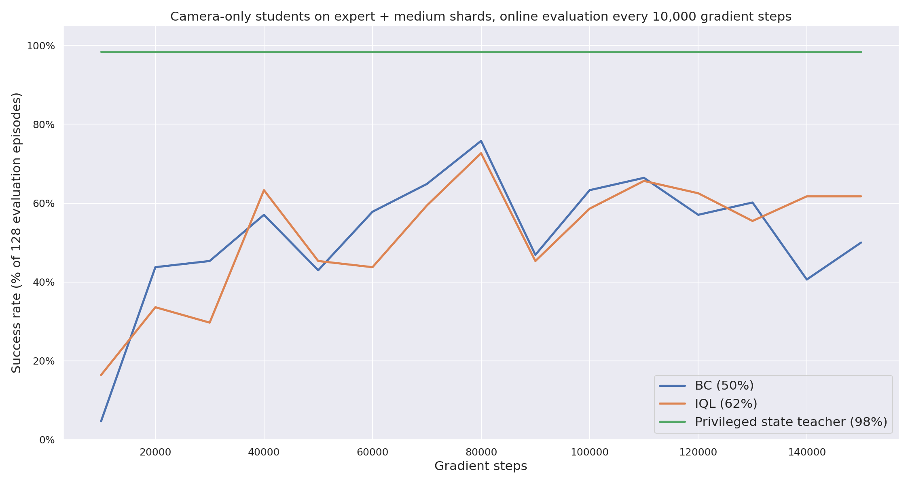

# Stage 2.1 — offline RL from the camera shards (first runs)

Two camera-only students trained on `expert_v3c` + `medium_v3c` (50/50, 2,014,214 legal transitions),
150,000 gradient steps at batch 256, online evaluation every 10,000 steps over 128 fresh camera envs.
Protocol, per-evaluation numbers and the reading of the curves: `pipeline/2_1_offline_rl/README.md`.

| Algorithm | Run | Best | Final | Mean of last 5 | Wall clock | W&B |
|---|---|---|---|---|---|---|
| BC | `students/bc_expert_medium_v1` | 0.758 @ 80 k | 0.500 | 0.548 | 0.64 h | [xy467x3h](https://wandb.ai/sebastian-dittert/food_robot/runs/xy467x3h) |
| IQL | `students/iql_expert_medium_v1` | 0.727 @ 80 k | 0.617 | 0.614 | 1.84 h | [597r6u3q](https://wandb.ai/sebastian-dittert/food_robot/runs/597r6u3q) |
| Privileged state teacher | `teachers/teacher_v3c_20260920T120408Z` | — | 0.984 | — | — | — |

Regenerate the figure from the run manifests:

    ./scripts/spark.sh python docs/experiments/pipeline_stage2_1/plot_curves.py \
        /workspace/artifacts/students/bc_expert_medium_v1 /workspace/artifacts/students/iql_expert_medium_v1 \
        out=/workspace/artifacts/students/stage2_1_success_rate.png
