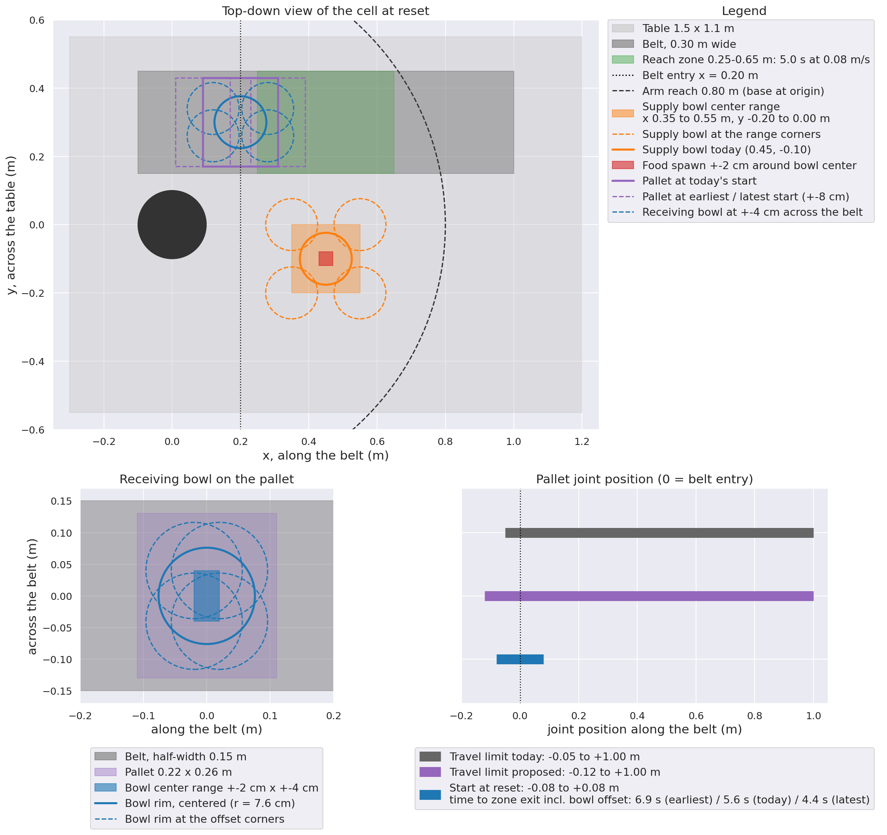
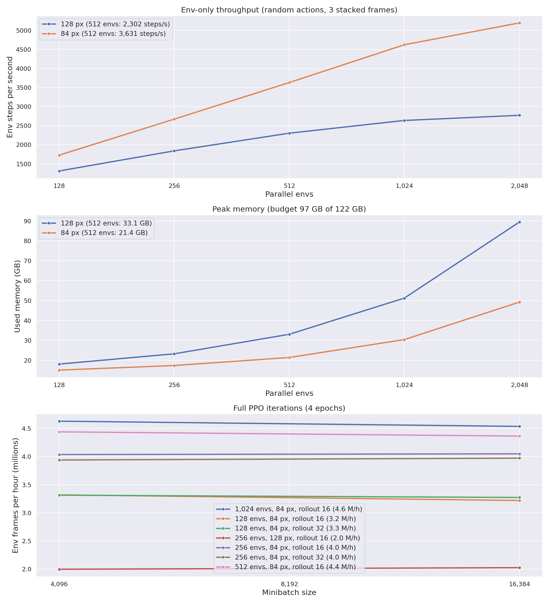

# Pixel PPO run 1

Can PPO learn the food-cell pick-and-place task from two camera images plus robot joint state alone — no
privileged food state and no belt bowl position — under geometric domain randomization?

## Setup

- Env: `FoodRobot-Cell-v0`, Franka, rigid food, 50 Hz control, staged dense reward. One change during run 1:
  `reach_food`'s shaping width went from 0.1 m to 0.3 m after the first sanity run showed it was flat at the arm's
  start pose (~0.005 at the ~0.48 m the gripper starts from, while the action and velocity penalties contributed
  ~10x more, so the return fell for all 41 iterations). Weights, staged structure and penalties are unchanged.
- Observations (actor and critic): `proprio` + `pixels` (`overview_rgb`, `wrist_rgb`), 3 stacked frames each.
- Networks: separate actor and critic; per-camera CNN (32/64/64, 8/4/3, strides 4/2/1 → 256), proprio →
  Linear 128 + LayerNorm + ELU, fusion MLP 512-256; TanhNormal actor.
- Domain randomization (per episode): supply bowl x ∈ [0.35, 0.55] m, y ∈ [−0.20, 0.00] m; food ±2 cm inside it;
  pallet start ∈ [−0.08, 0.08] m (bowl leaves the zone after 4.4–6.9 s at 0.08 m/s); bowl offset on the pallet
  x ±2 cm, y ±4 cm; belt speed fixed at 0.08 m/s.

## Benchmark

Scaling benchmark on the DGX Spark (122 GB total memory), run in `scripts/benchmark_pixels.py`. Phase A measured
env-only throughput (random actions, 3 stacked frames) for `num_envs` ∈ {128, 256, 512, 1024, 2048} × image size
∈ {84, 128}. Phase B ran full PPO iterations (4 epochs) for the fastest Phase-A configurations within the memory
budget, across `rollout_steps` ∈ {16, 32} and `mini_batch_size` ∈ {4096, 16384}. Selection rule: highest env
frames/hour with peak memory below 80% of total memory (97.4 GB of 121.7 GB) and update time at most 80% of each
iteration (both measured configurations spend ~65-69% of an iteration in the PPO update — two CNN encoders, 4
epochs — so a tighter cap would reject every configuration). The selected configuration is **512 envs, 84 px
images, rollout 16, mini-batch 4096**: 4,438,733 env frames/hour, 6.644 s/iteration (2.322 s collect + 4.322 s
update, 65% update share), peak memory 62.1 GB (51% of total). At this rate the 1-billion-frame training budget
is an estimated **243.8 hours** (~10.2 days), including periodic evaluation every 136 iterations.

A faster but memory-tight alternative was also measured: **1024 envs, 84 px, rollout 16, mini-batch 4096** reaches
4,628,280 frames/hour (237.6 h for 1 billion frames) but peaked at **111.73 GB — 92% of total system memory**,
over the 80% budget, so the selection rule excludes it. It is recorded here for reference in case the 243.8 h
estimate is judged too slow.

| phase | num_envs | image | rollout_steps | mini_batch_size | status | env_steps_per_s | frames_per_hour | update_share | peak_used_gb |
|---|---|---|---|---|---|---|---|---|---|
| A | 128 | 84 | | | ok | 1726.2 | | | 15.08 |
| A | 256 | 84 | | | ok | 2671.2 | | | 17.37 |
| A | 512 | 84 | | | ok | 3630.9 | | | 21.41 |
| A | 1024 | 84 | | | ok | 4622.1 | | | 30.4 |
| A | 2048 | 84 | | | ok | 5195.3 | | | 49.23 |
| A | 128 | 128 | | | ok | 1311.4 | | | 18.1 |
| A | 256 | 128 | | | ok | 1839.0 | | | 23.26 |
| A | 512 | 128 | | | ok | 2302.4 | | | 33.07 |
| A | 1024 | 128 | | | ok | 2636.5 | | | 51.23 |
| A | 2048 | 128 | | | ok | 2771.3 | | | 89.43 |
| B | 2048 | 84 | | | skipped_memory | | | | 111.2 (est.) |
| B | 1024 | 84 | 16 | 4096 | ok | 4121.3 | 4,628,280 | 0.688 | 111.73 |
| B | 1024 | 84 | 16 | 16384 | ok | 4083.5 | 4,535,527 | 0.692 | 117.85 |
| B | 1024 | 84 | | | skipped_memory | | | | 111.8 (est.) |
| B | **512** | **84** | **16** | **4096** | **ok** | **3527.9** | **4,438,733** | **0.65** | **62.1** |
| B | 512 | 84 | 16 | 16384 | ok | 3372.5 | 4,363,207 | 0.64 | 66.06 |
| B | 2048 | 128 | | | skipped_memory | | | | 467.4 (est.) |
| B | 256 | 84 | 16 | 4096 | ok | 2531.8 | 4,035,365 | 0.557 | 40.33 |
| B | 256 | 84 | 16 | 16384 | ok | 2554.9 | 4,047,841 | 0.559 | 40.04 |
| B | 256 | 84 | 32 | 4096 | ok | 2470.1 | 3,938,219 | 0.556 | 61.38 |
| B | 256 | 84 | 32 | 16384 | ok | 2447.6 | 3,971,135 | 0.549 | 59.94 |
| B | 1024 | 128 | | | skipped_memory | | | | 240.2 (est.) |
| B | 512 | 128 | | | skipped_memory | | | | 127.6 (est.) |
| B | 256 | 128 | 16 | 4096 | ok | 1649.7 | 1,997,273 | 0.663 | 70.5 |
| B | 256 | 128 | 16 | 16384 | ok | 1713.1 | 2,024,870 | 0.672 | 70.73 |
| B | 128 | 84 | 16 | 4096 | ok | 1733.9 | 3,319,342 | 0.468 | 26.38 |
| B | 128 | 84 | 16 | 16384 | ok | 1629.2 | 3,218,609 | 0.447 | 26.51 |
| B | 128 | 84 | 32 | 4096 | ok | 1706.0 | 3,313,141 | 0.46 | 37.26 |
| B | 128 | 84 | 32 | 16384 | ok | 1675.4 | 3,272,507 | 0.457 | 37.41 |

**Memory.** Env-only peaks scale from 15.1 GB (128 envs, 84 px) to 89.4 GB (2048 envs, 128 px); training adds the
collected batch several times over (the collector holds it twice as float32, plus GAE and minibatch
forward/backward), so a full PPO iteration at 1024 envs / 84 px / rollout 16 peaked at 111.7 GB and at 2048 envs
/ 84 px / rollout 16 exhausted all 121 GB — the kernel OOM killer took down `dbus-daemon`, `runc` and
`containerd-shim` and the whole machine with it. A second attempt, after switching to a memory estimate
(`training_estimate_gb`) that pre-skips configurations expected to exceed the budget, still took the Spark down
a second time: SSH stopped completing its banner exchange while ping kept answering, and the machine needed a
physical power-cycle. The script now also kills a measured run itself once it crosses 85% of total memory
(recording it as `aborted_memory`) so an estimate that is still wrong cannot repeat either incident; combined
with raising the estimate's calibration factor from 4x to 10.5x the collected batch (calibrated against the
measured 1024/84/rollout-16 row), configurations whose estimated training memory exceeds the 80% budget are now
correctly reported as `skipped_memory` — 1024 and 2048 envs at both image sizes — and no run in the final pass
crossed the kill threshold.

## Sanity run

The 45-minute sanity run is the gate before the long run. The first attempt crashed at iteration 41 of 364 with a
`KeyError` inside `compute_advantage`: TorchRL's `ValueEstimatorBase._sanitize_next_obs_nan` substitutes the NaN
terminal observations (which `IsaacLabWrapper(native_autoreset=True)` writes by design) on a *shallow copy*, so a
GAE chunk containing an episode boundary came back without `state_value` while the other kept it, and `torch.cat`
rejected the mismatched key sets. Fixed in `369996b`, with a regression test that reproduces the exact asymmetry.

That run also showed the reach reward was flat at the start pose, which is why `reach_food`'s width was widened
(see Setup). The second sanity run reached `PPO_DONE` and wrote checkpoints and an evaluation video:
`episode_reward/reach_food` rose from 0 to a 0.25 peak (against 7.6e-05 before the change) and the deterministic
evaluation return reached +2.4, while the training return still showed large negative excursions because each
tipped bowl costs −150 and the policy had begun reaching the belt (bowl-tipped 10.2% of episodes by the end).
Success was still 0% and `grasp_lift` still 0 at 2.8 M frames — 1.4% of the training budget.

## Long run

- Budget: 200 million env frames (~47 h at the measured 4.27 M frames/hour); early stop once the training success
  rate is at least 85% in 10 consecutive iterations. The policy is saved as `checkpoints/ppo_pixels_final.pt`
  before the run ends, whatever ends it — budget, early stop, `max_hours`, SIGTERM or an exception.
- Started: 2026-09-16 08:34 UTC, container `food-robot-20260916-103456` on the DGX Spark, Hydra run directory
  `outputs/2026-09-16/08-34-57/`. Estimated end without early stop: 2026-09-18 ~07:20 UTC.
- W&B: https://wandb.ai/sebastian-dittert/food_robot/runs/vophimmg
- Config: `sota-implementations/ppo/config_pixels.yaml` at commit `a29a2fc` (512 envs, 84 px, 3 stacked frames,
  rollout 16, mini-batch 4096, 24,414 iterations).
- Status: **stopped deliberately at 27,779,072 frames** (iteration ~3385, 7.2 h) once the diagnosis below was
  conclusive — `STOP_REASON {"reason": "sigterm"}`, `PPO_DONE`, and `checkpoints/ppo_pixels_final.pt` written, so
  the crash-safety wrapper's exit path is confirmed working. The run reached `reach_food` 0.482 and rising, with
  `grasp_lift` ~0, `transport` 0.308 and no successes; see the two top rows of the improvements table.
- Stop a run gracefully (finishes the iteration, saves the final checkpoint):

      ssh spark 'docker exec <container> pkill -TERM -f "kit/python/bin/python3.*ppo_pixels.py"'

  Note there is no space before `ppo_pixels.py`: the command line is `.../python3 sota-implementations/ppo/ppo_pixels.py`,
  so a pattern ending in `" ppo_pixels.py"` matches nothing and the run keeps going. `docker stop` does not work
  either: Isaac Sim's `python.sh` starts Python without `exec`, so SIGTERM reaches the bash wrapper (PID 1) and is
  never forwarded — and signalling that wrapper would kill the container before the checkpoint is written.

## Improvements for the next run

Collected while run 1 was in progress; none of them was applied to it.

| Change | Why |
|---|---|
| Evaluate every ~5 M frames (`eval.interval_iterations: 610`) instead of every 1.1 M (136) | Each evaluation resets every env and collects ~32 batches — a full episode for all 512 envs — costing ~8% of wall-clock at the current interval, against under 2% at 5 M frames. The curve does not need that resolution. |
| Judge the sanity gate on the deterministic evaluation return, not the training return | Run 1's sanity gate failed its trend check while the policy was clearly improving: each tipped bowl costs −150, so the training return collapses exactly when the policy first starts touching the bowl. The evaluation return rose steadily throughout. |
| Keep camera observations as uint8 end to end | The collector holds each batch twice in float32, which is what forced 512 envs (62 GB) rather than 1024 (112 GB, 4% faster). uint8 observations would cut that ~4x and open up the larger, faster configurations. |
| Re-run the smoke tests after any change to the exit path | The crash-safety wrapper (`a29a2fc`) went in without its smoke tests being re-run, because the launch agent died first. The exit path was verified by reading instead. |
| Render with the training config's image size | `scripts/render_episode.py` takes `image_size` from the environment defaults (128×128) and never reads `config_pixels.yaml`, so its "policy input" panels showed more detail than the policy trains on (84×84) until re-rendered with `env.image_size=[84,84]`. Renders meant to show what the policy sees should take the image size from the run's config. |
| Revisit the PPO update cost | 65-69% of every iteration is the update (two CNN encoders x 4 epochs), so throughput is update-bound, not simulation-bound. Fewer epochs or a lighter critic encoder would raise frames/hour directly. |
| Investigate the grasp stage if `grasp_lift` stays at 0 | Reaching improves steadily, but nothing past it has been exercised yet, so the grasp detection thresholds and gripper control remain unproven in training. |
| Raise gripper-to-food friction | Diagnosed at 27.6 M frames of run 1, where the grasp looked slippery in the videos. The food's material is randomized per episode to static 0.3-1.0 / dynamic 0.2-0.8, while this repo sets no material for the Franka's fingers, so they take the PhysX default (0.5/0.5) and the combine mode is unset (averaged) — an effective dynamic friction of only ~0.35-0.65 against a smooth 4 cm sphere held by flat pads, i.e. two near-point contacts. Grip force is not the limit: the finger drive has stiffness 2e3 and a 200 N effort limit against a fully closed target. Set the finger material explicitly, raise the food's lower bound, and consider a shape that is less adversarial for parallel jaws than a sphere. |
| Make `transport` require an actual lift | The larger shaped reward can be collected without ever holding the food. `transport` (weight 10) is gated on `grasped_mask` alone (`food_robot/envs/mdp/rewards.py:58`), which only asks that the food is within 4 cm of the TCP and the fingers stopped between open and closed — never that the food is lifted or held. `grasp_lift` (weight 5) is the only term that checks `food_z > 0.10`. At 27.6 M frames run 1 showed exactly the resulting behaviour: `transport` 0.308 with `grasp_lift` ~0 and no successes, i.e. the policy chases the bowl with the food loosely between the fingers. Gate `transport` on a genuine hold (lift height, or food velocity tracking the TCP) so the reward cannot be farmed without picking the food up. |
