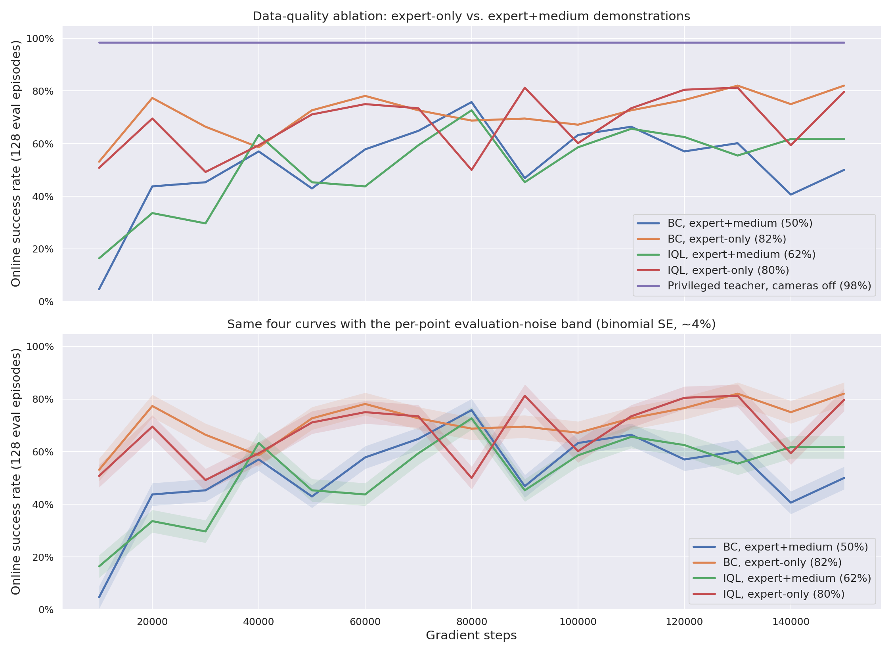
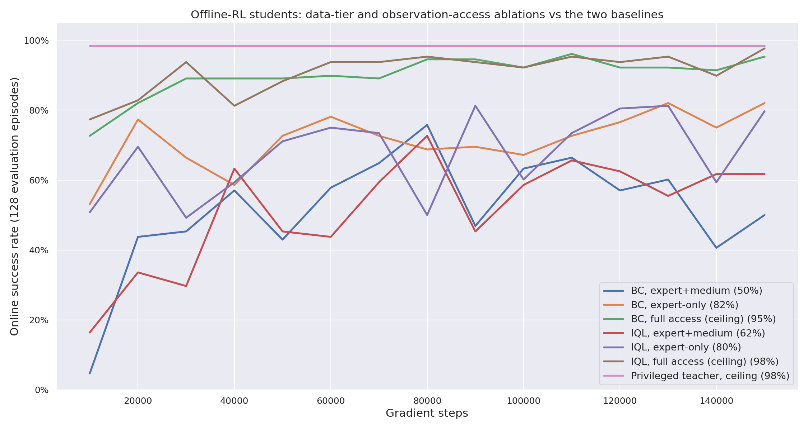

# Stage 2.1 · offline RL from the camera shards

Train a **camera-only student** on the shards recorded in stage 1, with no simulator in the loop except for
evaluation. Behaviour cloning is the baseline; IQL is the first value-based algorithm. CQL and TD3+BC will
follow the same shape, so that the only thing that differs between rows of the results table is the
objective.

## The comparison protocol

Every algorithm in this folder gets the same everything except its loss:

| | |
|---|---|
| **Data** | `expert_v3c` + `medium_v3c`, 50/50 rows per batch (2,014,214 legal transitions, 14,333 of them terminal) |
| **Student inputs** | **cameras only** by default — `("pixels","overview_rgb")` and `("pixels","wrist_rgb")`, 84x84x3 uint8, **one frame each**. No proprioception, no privileged state, no bowl pose. Configurable via `network.in_keys` (group names or leaf keys, expanded with `pickplace.keys.expand_in_keys`); vector groups go through an MLP branch and concatenate with the CNN features (`pickplace.offline.PixelNet`, same shape as `sota-implementations/ppo/utils_pixels.py::PixelsNet`). |
| **Networks** | one Nature-CNN encoder per camera (32/64/64 channels, 8/4/3 kernels, 4/2/1 strides, 256-d embedding) → fusion MLP `[512, 256]`. Separate encoders per head (actor, each Q, V). |
| **Batch** | 256 transitions |
| **Budget** | 150,000 gradient steps (~19 passes over the data) |
| **Evaluation** | every 10,000 gradient steps: 128 fresh camera envs, deterministic policy, `max_episode_length + 1` steps, each env's **first** finished episode scored — byte-for-byte the protocol `pipeline/0_state_teacher/evaluate.py` used to score the teacher, so student and teacher numbers compare directly |
| **Reward** | scaled by 0.1 before the loss (BC ignores it) |

`tests/unit/test_offline_configs.py` asserts that the shared block of every `config.yaml` in this folder is
identical, so the protocol cannot drift between algorithms by accident.

**The student has to infer arm and gripper state from pixels.** Nothing in its input says where the joints
are, whether the gripper is open or whether the food is held — that has to come out of the wrist view (the
overview camera mostly supplies the bowl's position on the belt). This is the interesting part of the
setting and the main reason a camera-only student is expected to fall short of the privileged teacher.

## Transitions: what a "pair of rows" is

A shard stores one row per env step, time-major, and **does not store next observations**. So the successor
state of row `i` is row `i + successor_stride` (the collection's `num_envs`, 512). `pickplace.offline`
precomputes the legal pairs once per shard as an index tensor (never a per-batch scan):

* **ongoing** — row `i` has no done flag and `i + stride` is inside the shard → `next_obs` is row `i + stride`,
  `terminated = False`.
* **terminal** — row `i` is `terminated` and not `truncated` → the episode ended here, so the bootstrap is
  masked (`terminated = True`) and `next_obs` is a placeholder (row `i` itself) multiplied by zero in the TD
  target. **These pairs are kept on purpose**: with `simple_v3b` the success bonus is 150 of a ~182 mean
  episode return, so dropping terminal rows would hide 80%+ of the reward from any value-based method.
  Set `data.include_terminals=false` to drop them anyway.
* **truncated** rows are dropped — the episode did not end, but its next observation genuinely is not in the
  shard, so neither bootstrapping nor masking would be right.

No pair ever spans an episode boundary. `tests/unit/test_offline.py` pins this down on a synthetic shard with
known boundaries: the exact legal index set, the successor row, the terminal flags, and the fact that every
sampled pair is one of the legal ones.

Tier mixing is a fixed number of rows per shard per batch (largest-remainder split of `batch_size` by
`data.proportions`), concatenated — not `ReplayBufferEnsemble`, because a shard's legal rows are a
precomputed subset *and* its successor row has to be gathered at `+stride`, which no stock sampler expresses.

## Run

    # baseline
    ./scripts/spark.sh --detach python pipeline/2_1_offline_rl/bc/train.py

    # IQL
    ./scripts/spark.sh --detach python pipeline/2_1_offline_rl/iql/train.py

Useful overrides: `gradient_steps=`, `batch_size=`, `data.shards=[expert_v3c,medium_v3c,noisy_v3c]`,
`data.proportions=[...]`, `network.in_keys=[[pixels,overview_rgb],[pixels,wrist_rgb],proprio,belt,privileged]`
(cameras + everything the teacher saw), `eval.interval=`, `eval.num_envs=`, `checkpoint.interval=`, `optim.lr=`,
IQL's `loss.expectile=` / `loss.temperature=` / `loss.gamma=` / `loss.target_tau=`, `run.name=`,
`logger.backend=null`. Stop a run cleanly (final checkpoint + evaluation) with

    ssh spark 'docker exec <container> pkill -TERM -f "kit/python/bin/python3.*train.py"'

## Where results land

`$FOOD_ROBOT_ARTIFACTS/students/<run>/`:

* `manifest.json` — git commit, full config, one provenance block per shard (name, frames, legal
  transitions, source checkpoint + sha256, reward set and weights, the shard's own success rate), the W&B
  URL, `eval_history` (one entry per evaluation) and `best_eval`.
* `checkpoints/<algo>_<step>.pt` + `.json` — the sidecar manifest repeats the git commit, config and shard
  provenance and adds the **online evaluation at that checkpoint** and the checkpoint's sha256.
* stdout: `RUN_INFO`, `METRICS {json}` every `log_interval` steps, `EVAL`, `CHECKPOINT`, `STOP_REASON`,
  `<ALGO>_DONE`.

W&B project `food_robot`, group `offline_rl`.

## Results

Teacher (privileged state, cameras off, same evaluation protocol): **0.984** success.

| Algorithm | Run | Steps | Best | Final | Mean of last 5 evals | Wall clock | W&B |
|---|---|---|---|---|---|---|---|
| BC | `students/bc_expert_medium_v1` | 150 k | 0.758 @ 80 k | 0.500 | **0.548** | 0.64 h | [xy467x3h](https://wandb.ai/sebastian-dittert/food_robot/runs/xy467x3h) |
| IQL | `students/iql_expert_medium_v1` | 150 k | 0.727 @ 80 k | 0.617 | **0.614** | 1.84 h | [597r6u3q](https://wandb.ai/sebastian-dittert/food_robot/runs/597r6u3q) |
| CQL | *planned* | | | | | | |
| TD3+BC | *planned* | | | | | | |

Success rate per evaluation (128 episodes each, so one episode is 0.8 points and the binomial standard error
around 0.6 is about 0.043):

| Gradient steps (k) | 10 | 20 | 30 | 40 | 50 | 60 | 70 | 80 | 90 | 100 | 110 | 120 | 130 | 140 | 150 |
|---|---|---|---|---|---|---|---|---|---|---|---|---|---|---|---|
| BC | .05 | .44 | .45 | .57 | .43 | .58 | .65 | **.76** | .47 | .63 | .66 | .57 | .60 | .41 | .50 |
| IQL | .16 | .34 | .30 | .63 | .45 | .44 | .59 | **.73** | .45 | .59 | .66 | .63 | .55 | .62 | .62 |

**Reading it.** Both curves climb fast to ~0.45 by 30-40 k and then oscillate in a 0.4-0.76 band with no
further trend — flat from roughly 60 k on, so the 150 k budget is already past the point of return. The
swings are much larger than evaluation noise (±0.04), so they are real policy changes from step to step, not
sampling error: with a state-independent scale that has collapsed (BC's mean scale falls from 0.98 to ~0.12
by 10 k steps), a small drift in the mean action changes the grasp outcome on a large share of episodes.
The two algorithms are within noise of each other on the best checkpoint (0.76 vs 0.73), but IQL is the more
stable of the two late in training (last-five mean 0.61 vs 0.55, and BC's last three evaluations are its
worst since 30 k). A camera-only student reaches roughly **three quarters of the teacher's 0.984 at its best
checkpoint and about 60% on average**, which is the cost of removing proprioception and privileged state.

**What to try next**, in the order the evidence suggests: pick checkpoints by evaluation rather than by step
(the best checkpoint beats the final one by 15-25 points in both runs); average several evaluations per point
or use more evaluation envs so the selection is not chasing noise; add the `noisy_v3c` tier for state
coverage; and give the actor a learned, state-dependent scale so it can stay stochastic where the data is
ambiguous. CQL and TD3+BC come next and inherit this protocol unchanged.

## Ablations: data quality and observation access

Two ablations on top of the two baselines above, same protocol (150 k steps, batch 256, eval every 10 k over
128 envs, same seed): **data quality** — cameras-only inputs, `expert_v3c` alone (1 M frames) instead of
expert+medium — and **observation access** — expert+medium data, but `network.in_keys` extended to
`pixels + proprio + belt + privileged`, i.e. everything the teacher itself saw. The second one is a ceiling
this dataset supports, not a deployable policy (a real deployment has no privileged state), so read it as
"how much of the gap is the camera bottleneck" rather than as a candidate for shipping.

### Data quality: does the medium tier help?

| Algorithm | Run | Best | Final | Mean of last 5 evals | Wall clock | W&B |
|---|---|---|---|---|---|---|
| BC | `students/bc_expert_medium_v1` (expert+medium) | 0.758 @ 80 k | 0.500 | 0.548 | 0.64 h | [xy467x3h](https://wandb.ai/sebastian-dittert/food_robot/runs/xy467x3h) |
| BC | `students/bc_expert_only` (expert-only) | **0.820 @ 130 k** | **0.820** | **0.777** | 0.52 h | [wj4kg3hy](https://wandb.ai/sebastian-dittert/food_robot/runs/wj4kg3hy) |
| IQL | `students/iql_expert_medium_v1` (expert+medium) | 0.727 @ 80 k | 0.617 | 0.614 | 1.84 h | [597r6u3q](https://wandb.ai/sebastian-dittert/food_robot/runs/597r6u3q) |
| IQL | `students/iql_expert_only` (expert-only) | **0.813 @ 90 k** | **0.797** | **0.748** | 1.82 h | [d2ia8nor](https://wandb.ai/sebastian-dittert/food_robot/runs/d2ia8nor) |

**The medium tier hurts, for both algorithms.** Dropping it raises BC's best checkpoint by 6 points (0.758 →
0.820) and, far more strikingly, its final-checkpoint stability: final success goes from 0.500 (BC's
collapsed, worst-since-30k state at 150 k on the mixed data) to 0.820 — the same as its best. Last-five-eval
mean rises from 0.548 to 0.777. IQL improves by a similar or larger margin on every metric: best +0.086
(0.727 → 0.813), final +0.180 (0.617 → 0.797), last-five mean +0.134 (0.614 → 0.748).

**IQL does not show the theoretically-expected benefit from mixed-quality data.** IQL's whole pitch —
expectile value estimation plus advantage-weighted policy extraction — is supposed to let it exploit a mix of
good and bad demonstrations better than plain cloning, tolerating (or even benefiting from) the lower-quality
tier that BC just imitates blindly. That is not what happens here: on every metric IQL's improvement from
removing `medium_v3c` is at least as large as BC's, in relative terms comparable (best: +12% vs +8%; final:
+29% vs +64%, though BC's baseline final of 0.500 was an anomalous late-training collapse rather than a
stable number, so that particular ratio overstates BC's gain). The `medium_v3c` tier is teacher rollouts with
Gaussian action noise added, not a distinct suboptimal *policy* — it does not give IQL new strategies to
reweight toward, only noisier transitions and a lower average return to estimate advantages against, which
seems to cost both algorithms rather than help either.

**Read against the teacher.** Expert-only best checkpoints reach ~81-83% of the teacher's 0.984 (0.820/0.984,
0.813/0.984) — noticeably closer than the expert+medium runs' ~75%. Since the *inputs* did not change (still
cameras only), this gap between the two data tiers is entirely a data-quality effect, not an observation
one; see below for how much of the *remaining* ~17-19 points is the camera-only bottleneck rather than the
algorithm.

### Observation access: how much of the gap is the camera bottleneck?

Same `expert_v3c` + `medium_v3c` data as the baselines, but `network.in_keys` extended from cameras-only to
`[[pixels,overview_rgb],[pixels,wrist_rgb],proprio,belt,privileged]` — everything the teacher itself saw, via
`pickplace.keys.expand_in_keys`. **This is a ceiling, not a deployable policy**: a real deployment has no
privileged food/bowl pose, so treat these two rows as measuring the observation bottleneck, not as a
candidate to ship.

| Algorithm | Run | Best | Final | Mean of last 5 evals | Wall clock | W&B |
|---|---|---|---|---|---|---|
| BC | `students/bc_full_access` (pixels+proprio+belt+privileged) | **0.961 @ 110 k** | 0.953 | 0.934 | 0.78 h | [nyl05r0b](https://wandb.ai/sebastian-dittert/food_robot/runs/nyl05r0b) |
| IQL | `students/iql_full_access` (pixels+proprio+belt+privileged) | **0.977 @ 150 k** | 0.977 | 0.944 | 2.04 h | [qg07vj09](https://wandb.ai/sebastian-dittert/food_robot/runs/qg07vj09) |

**Full observation access nearly closes the gap to the teacher, on the same data the cameras-only runs used.**
BC's best checkpoint goes from 0.758 (cameras only) to 0.961 (full access) against a teacher of 0.984 — that
closes (0.984−0.758) − (0.984−0.961) = 0.203 of the original 0.226-point gap, i.e. **90%** of it. IQL closes
even more: 0.727 → 0.977 closes (0.257 − 0.007)/0.257 = **97%** of its gap. On final-checkpoint numbers the
picture is the same or stronger (BC closes 94% of its gap, IQL 98%). **So the large majority of the gap
between a camera-only offline-RL student and the privileged-state teacher is the observation bottleneck, not
the offline-RL algorithm or the offline-vs-online training regime** — plain BC with the teacher's own inputs
gets within 2-3 points of the teacher, and IQL gets within one point, using nothing but a fixed dataset and
150 k gradient steps. Offline RL is not the limiting factor here; not being able to see the robot's own joint
state and the food/bowl pose is.

**Data quality still shows through even at full access.** IQL, full-access (expert+medium) reaches 0.977 vs
BC, full-access (expert+medium) 0.961 — both close to the teacher, but IQL is again the steadier of the two
(its evaluation curve stays in the 0.90-0.98 band from 30 k on, where BC dips to 0.89 mid-run). The
expert-only vs expert+medium effect documented above is specific to the camera-only bottleneck being present;
once the student can see what the teacher saw, 2 M transitions of mixed-quality data are enough to reach the
ceiling regardless.

## Adding an algorithm

Create `pipeline/2_1_offline_rl/<algo>/{train.py,utils.py,config.yaml}`:

* `config.yaml` — copy another algorithm's file and change only the block below `optim:` (the parity test
  enforces the rest).
* `utils.py` — `make_algo(cfg, obs_shapes, obs_keys, action_dim, device)` returning an object with
  `.policy` (the module that is evaluated and checkpointed), `.update(batch) -> {name: scalar}` and
  `.state_dict()`. Build the networks with `pickplace.offline.make_actor` / `make_qvalue` / `make_value` so
  the architecture stays identical.
* `train.py` — copy another algorithm's; it only launches the Isaac app and hands `make_algo` to
  `runner.train`.
* Add the algorithm to the results table and to the smoke test's parametrization.
