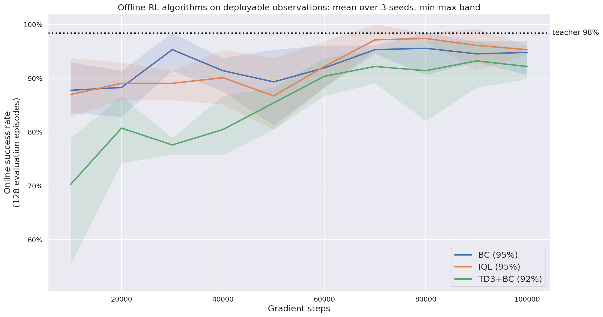
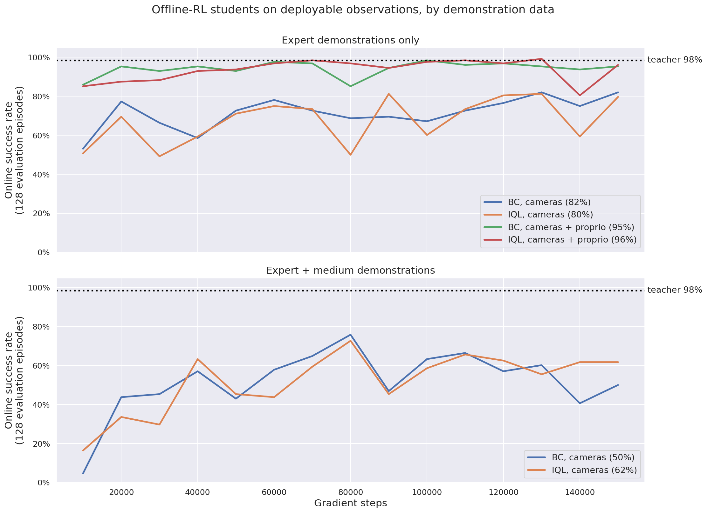

# Stage 2.1 · offline RL from the camera shards

Train a **deployable student** on the shards recorded in stage 1, with no simulator in the loop except for
evaluation. Four algorithms live here — **BC**, **IQL**, **TD3+BC** and **CQL** — sharing one runner, one
set of networks, one data mix and one evaluation protocol, so that the only thing that differs between rows
of the results table is the objective. The comparison below is the first three; **CQL is parked** (it does
not learn on zero-action-noise data — see "CQL — parked" for the investigation and what to retry).

## The comparison protocol

Every algorithm in this folder gets the same everything except its loss:

| | |
|---|---|
| **Data** | `expert_v3c` + `medium_v3c`, 50/50 rows per batch (2,014,214 legal transitions, 14,333 of them terminal) |
| **Student inputs** | **image only** by default — `("pixels","overview_rgb")` and `("pixels","wrist_rgb")`, 84x84x3 uint8, **one frame each**. No proprioception, no privileged state, no bowl pose. Configurable via `network.in_keys` (group names or leaf keys, expanded with `pickplace.keys.expand_in_keys`); vector groups go through an MLP branch and concatenate with the CNN features (`pickplace.offline.PixelNet`, same shape as `sota-implementations/ppo/utils_pixels.py::PixelsNet`). |
| **Networks** | one Nature-CNN encoder per camera (32/64/64 channels, 8/4/3 kernels, 4/2/1 strides, 256-d embedding) → fusion MLP `[512, 256]`. Separate encoders per head (actor, each Q, V). |
| **Batch** | 256 transitions |
| **Budget** | 150,000 gradient steps (~19 passes over the data) |
| **Evaluation** | every 10,000 gradient steps: 128 fresh camera envs, deterministic policy, `max_episode_length + 1` steps, each env's **first** finished episode scored — byte-for-byte the protocol `pipeline/0_state_teacher/evaluate.py` used to score the teacher, so student and teacher numbers compare directly |
| **Reward** | scaled by 0.1 before the loss (BC ignores it) |

`tests/unit/test_offline_configs.py` asserts that the shared block of every `config.yaml` in this folder is
identical, so the protocol cannot drift between algorithms by accident. The committed defaults are the
image-only, expert+medium, 150 k-step protocol the first runs used; the comparison below overrides the
data, the inputs and the budget on the command line, identically for every algorithm.

**The student has to infer arm and gripper state from pixels.** Nothing in its input says where the joints
are, whether the gripper is open or whether the food is held — that has to come out of the wrist view (the
overview camera mostly supplies the bowl's position on the belt). This is the interesting part of the
setting and the main reason a camera-only student is expected to fall short of the privileged teacher.

## What each algorithm adds, and where its hyperparameters come from

Every algorithm uses `pickplace.offline`'s networks (`make_actor` / `make_qvalue` / `make_value`), Adam at
`lr 3e-4`, and gradient clipping at norm 10 — the same optimizer for all four, so the objective is the only
difference. Defaults come from TorchRL's own `sota-implementations` configs; the deviations are listed.

| | Objective | Hyperparameters (all in `<algo>/config.yaml`) |
|---|---|---|
| **BC** | maximise the log-probability of the dataset action under the TanhNormal actor | none beyond the optimizer |
| **IQL** | expectile value loss + advantage-weighted policy (`IQLLoss`) | `expectile 0.7`, `temperature 3.0`, twin Q, `target_tau 0.005` |
| **TD3+BC** | TD3 with the actor's Q term rescaled so a BC term stays comparable to it (`TD3BCLoss`) | `alpha 0.025` (measured, not copied), `policy_noise 0.2`, `noise_clip 0.5`, `policy_update_delay 2`, twin Q, `target_tau 0.005` |
| CQL *(parked)* | SAC actor + a conservative log-sum-exp penalty on out-of-distribution actions (`CQLLoss`) | `temperature 1.0`, `num_random 2`, `min_q_weight 0.1` with the Lagrange dual off, `actor_scale_lb 0.1`, `policy_eval_start 4_000` |

**CQL** *(parked — kept here so the config is reproducible).* `temperature 1.0`, `max_q_backup false` and
`deterministic_backup false` are `sota-implementations/cql/offline_config.yaml`. The entropy weight
(`alpha`) is not pinned: as in the sota script it is learned from `alpha_init 1.0` against
`target_entropy "auto"` (= −action_dim), which is why the config has no `alpha` entry. Four deviations, two
of them forced by failures documented under "CQL — parked": `with_lagrange false` with
`min_q_weight 0.1` (the dual let the critic run away to Q ≈ −14,000), `actor_scale_lb 0.1` (matching the
sota's `model.scale_lb`, without which the entropy temperature diverges), and:

* **`num_random 2`, not 10.** The conservative penalty evaluates `3 × num_random × batch` state-action
  pairs through both Q nets on every gradient step. With an MLP over a state vector — the sota's setting —
  that is nearly free; with a Nature CNN per camera it re-encodes 84 px images and becomes the entire cost
  of the run. Measured on the Spark at batch 256 with image+proprio inputs: **8.4 / 5.2 / ~2.4 gradient
  steps per second at `num_random` 2 / 4 / 10**, i.e. **3.3 h / 5.3 h / ~11.5 h per 100 k-step run**,
  against 22 steps/s for IQL and 35 for TD3+BC. `num_random 2` is the largest value that keeps three seeds
  inside the grid's wall clock, and it is the one number to raise first when CQL is picked up again.
* **`policy_eval_start 4_000`, not 40 000.** The sota warm-starts the actor on the behaviour-cloning term
  for the first 40 k of its 1 M gradient steps; 4 k is the same 4% of our 100 k budget.

`loss_function smooth_l1` rather than the sota's `l2`, for the reason IQL already uses it here: `l2` needs
about ten times the gradient norm for the same fit on this reward scale.

**TD3+BC.** `policy_noise 0.2`, `noise_clip 0.5`, `policy_update_delay 2` and `target_tau 0.005` (the
sota's `target_update_polyak 0.995`) are `sota-implementations/td3_bc/config.yaml` unchanged — the paper's
values. Again `smooth_l1` instead of `l2`. The sota's `adam_eps 1e-4` is *not* adopted: keeping one
optimizer across the algorithms matters more here than one algorithm's epsilon. TD3+BC is the one
algorithm that cannot use the shared stochastic actor — `TD3BCLoss` reads `action` straight out of the
actor and adds the target-policy smoothing noise itself — so it uses
`pickplace.offline.make_deterministic_actor`: the same `PixelNet` body with a tanh head instead of a
TanhNormal distribution. `tests/unit/test_offline.py::test_only_td3_bc_gets_a_deterministic_actor` pins
that, because handing `TD3BCLoss` the stochastic actor would run, train and checkpoint without any error
while making its policy extraction meaningless.

* **`alpha 0.025`, not the paper's 2.5 — and this is the one number that had to be measured rather than
  copied.** `alpha` sets the Q-vs-BC balance: the loss scales the Q term by `lambda = alpha / mean|Q|`.
  On `expert_v3c` the paper's value gives **0.000 success for 60 k gradient steps** and 0.109 at 100 k.
  The reason is the data, not the loss (whose TD target, terminal masking and successor lookup were
  checked against a hand computation): `expert_v3c` has `noise_sigma = 0.0`, one deterministic teacher
  rolled out, so **every state in it was visited with exactly one action** and `Q(s, ·)` has no
  counterfactual to fit. Measured on a trained critic, `Q` varies by ±40 across states and by about **2**
  across actions — yet TD3+BC's own `alpha / mean|Q|` normalisation makes that action-blind gradient
  exactly as large as the BC gradient (0.0277 vs 0.0281), so half the actor's gradient is noise and the
  action MSE comes out 63× worse than BC's. Sweep at 20 k gradient steps, same protocol:

  | Data | `alpha` | 5 k | 10 k | 15 k | 20 k |
  |---|---|---|---|---|---|
  | `expert_v3c` | 2.5 (paper) | 0.000 | 0.000 | 0.000 | 0.000 |
  | `expert_v3c` | 0.25 | 0.016 | 0.102 | 0.227 | 0.227 |
  | `expert_v3c` | **0.025** | **0.680** | **0.719** | 0.617 | 0.648 |
  | `noisy_v3c` (`noise_sigma 0.2`) | 2.5 | 0.000 | 0.000 | 0.359 | 0.242 |

  Both knobs move the same way — shrinking `alpha` switches the noisy Q gradient off, and *adding action
  noise to the data* helps at the paper's `alpha` — which is the signature of a missing counterfactual in
  the data rather than of a misconfigured loss. Note the reward scale is not involved: `alpha / mean|Q|`
  is scale-invariant, so the shared `reward_scale 0.1` cancels out of the balance. **On a dataset with
  action noise, `alpha` should go back up towards 2.5.**

**One wiring fix worth knowing about.** `CQLLoss` cannot be handed nested observation keys: it repeats the
observation once per sampled action with `tensordict.named_apply`, which matches on *leaf* names, so
`("pixels", "wrist_rgb")` never matches the actor's `in_keys` and is silently dropped from the repeated
tensordict. `cql/utils.py` therefore aliases the shard's nested keys onto flat ones (a view, not a copy) and
evaluates that aliasing module together with the actor. Nothing else in the folder is affected.

## Transitions: what a "pair of rows" is

A shard stores one row per env step, time-major, and **does not store next observations**. So the successor
state of row `i` is row `i + successor_stride` (the collection's `num_envs`, 512). `pickplace.offline`
precomputes the legal pairs once per shard as an index tensor (never a per-batch scan):

* **ongoing** — row `i` has no done flag and `i + stride` is inside the shard → `next_obs` is row `i + stride`,
  `terminated = False`.
* **terminal** — row `i` is `terminated` and not `truncated` → the episode ended here, so the bootstrap is
  masked (`terminated = True`) and `next_obs` is a placeholder (row `i` itself) multiplied by zero in the TD
  target. **These pairs are kept on purpose**: with `simple_v3b` the success bonus is 150 of a ~182 mean
  episode return, so dropping terminal rows would hide 80%+ of the reward from any value-based method.
  Set `data.include_terminals=false` to drop them anyway.
* **truncated** rows are dropped — the episode did not end, but its next observation genuinely is not in the
  shard, so neither bootstrapping nor masking would be right.

No pair ever spans an episode boundary. `tests/unit/test_offline.py` pins this down on a synthetic shard with
known boundaries: the exact legal index set, the successor row, the terminal flags, and the fact that every
sampled pair is one of the legal ones.

Tier mixing is a fixed number of rows per shard per batch (largest-remainder split of `batch_size` by
`data.proportions`), concatenated — not `ReplayBufferEnsemble`, because a shard's legal rows are a
precomputed subset *and* its successor row has to be gathered at `+stride`, which no stock sampler expresses.

## Run

    ./scripts/spark.sh --detach python pipeline/2_1_offline_rl/bc/train.py       # baseline
    ./scripts/spark.sh --detach python pipeline/2_1_offline_rl/iql/train.py
    ./scripts/spark.sh --detach python pipeline/2_1_offline_rl/cql/train.py
    ./scripts/spark.sh --detach python pipeline/2_1_offline_rl/td3_bc/train.py

One run at a time: each one holds a 128-env camera evaluation env, and two Isaac jobs at once have
OOM-killed the Spark. The four-algorithm comparison below was a single detached container looping over
seeds and algorithms, exactly one training process alive at any moment.

Useful overrides: `seed=`, `gradient_steps=`, `batch_size=`, `data.shards=[expert_v3c,medium_v3c,noisy_v3c]`,
`data.proportions=[...]`, `network.in_keys=[[pixels,overview_rgb],[pixels,wrist_rgb],proprio]`
(the deployable image+proprio variant; `belt` — the bowl's pose — is the one further group a real cell
might supply from a belt encoder), `eval.interval=`, `eval.num_envs=`, `checkpoint.interval=`, `optim.lr=`,
any `loss.*` key of the algorithm (IQL's `expectile`/`temperature`, CQL's `num_random`/`lagrange_thresh`,
TD3+BC's `alpha`/`policy_update_delay`), `run.name=`, `logger.backend=null`. Stop a run cleanly (final
checkpoint + evaluation) with

    ssh spark 'docker exec <container> pkill -TERM -f "kit/python/bin/python3.*train.py"'

## Where results land

`$FOOD_ROBOT_ARTIFACTS/students/<run>/`:

* `manifest.json` — git commit, full config, one provenance block per shard (name, frames, legal
  transitions, source checkpoint + sha256, reward set and weights, the shard's own success rate), the W&B
  URL, `eval_history` (one entry per evaluation) and `best_eval`.
* `checkpoints/<algo>_<step>.pt` + `.json` — the sidecar manifest repeats the git commit, config and shard
  provenance and adds the **online evaluation at that checkpoint** and the checkpoint's sha256.
* stdout: `RUN_INFO`, `METRICS {json}` every `log_interval` steps, `EVAL`, `CHECKPOINT`, `STOP_REASON`,
  `<ALGO>_DONE`.

W&B project `food_robot`, group `offline_rl`.

## Results: the three-algorithm, three-seed comparison

**One protocol, three objectives, three seeds.** `expert_v3c` only,
`network.in_keys=[[pixels,overview_rgb],[pixels,wrist_rgb],proprio]` (the deployable set: both cameras plus
the robot's own proprioception), 100,000 gradient steps, batch 256, evaluation every 10 k over 128 fresh
camera envs, seeds 0/1/2, W&B group `offline_rl`, runs named `<algo>_expert_proprio_s<seed>`. Everything was
run one at a time in a single detached container. Teacher reference, same evaluation protocol: **0.984**.

`mean ± half the seed range`. "Late stability" is the standard deviation of the last five evaluations,
averaged over seeds — lower is steadier. Evaluation noise alone is ±0.019 (binomial standard error at
p = 0.95 over 128 episodes), so **differences under about 0.04 are not differences**.

| Algorithm | Best | Final | Mean of last 5 | Steps to 0.90 | Late stability (sd) | Wall clock | Seed runs |
|---|---|---|---|---|---|---|---|
| **BC** | 0.979 ± 0.008 | 0.948 ± 0.031 | 0.944 ± 0.016 | **20 k ± 10 k** | 0.025 | **0.38 h** | [u1dw6agg](https://wandb.ai/sebastian-dittert/food_robot/runs/u1dw6agg) · [hcnamspj](https://wandb.ai/sebastian-dittert/food_robot/runs/hcnamspj) · [sst10l1f](https://wandb.ai/sebastian-dittert/food_robot/runs/sst10l1f) |
| **IQL** | **0.990 ± 0.012** | **0.953 ± 0.008** | **0.956 ± 0.011** | 27 k ± 15 k | 0.025 | 1.22 h | [29pbjq2u](https://wandb.ai/sebastian-dittert/food_robot/runs/29pbjq2u) · [hb56w7uy](https://wandb.ai/sebastian-dittert/food_robot/runs/hb56w7uy) · [9uup6qxu](https://wandb.ai/sebastian-dittert/food_robot/runs/9uup6qxu) |
| **TD3+BC** (`alpha 0.025`) | 0.958 ± 0.008 | 0.922 ± 0.027 | 0.919 ± 0.019 | 63 k ± 5 k | 0.036 | 0.83 h | [eclg2kb9](https://wandb.ai/sebastian-dittert/food_robot/runs/eclg2kb9) · [u6nau6bv](https://wandb.ai/sebastian-dittert/food_robot/runs/u6nau6bv) · [9bz3kwr5](https://wandb.ai/sebastian-dittert/food_robot/runs/9bz3kwr5) |
| TD3+BC at the paper's `alpha 2.5` | 0.219 | 0.109 | 0.102 | never | 0.090 | 0.83 h | [gc76ywhn](https://wandb.ai/sebastian-dittert/food_robot/runs/gc76ywhn) (seed 0 only — see above) |

CQL is **not** in this comparison; it is parked, and the investigation is recorded at the end of this
section.

Per-seed numbers (best @ step / final / last-5 mean / last-5 sd / steps to 0.90):

| | seed 0 | seed 1 | seed 2 |
|---|---|---|---|
| BC | 0.984 @ 30 k / 0.969 / 0.961 / 0.013 / 20 k | 0.984 @ 80 k / 0.906 / 0.944 / 0.030 / 10 k | 0.969 @ 100 k / 0.969 / 0.928 / 0.031 / 30 k |
| IQL | 1.000 @ 70 k / 0.945 / 0.945 / 0.043 / 10 k | 0.977 @ 90 k / 0.961 / 0.967 / 0.006 / 40 k | 0.992 @ 90 k / 0.953 / 0.956 / 0.026 / 30 k |
| TD3+BC | 0.969 @ 80 k / 0.914 / 0.934 / 0.039 / 70 k | 0.953 @ 80 k / 0.898 / 0.925 / 0.021 / 60 k | 0.953 @ 100 k / 0.953 / 0.897 / 0.047 / 60 k |

### Which one would I pick, and do the differences beat the seed spread?

**Pick BC.** On every success metric BC and IQL are the same policy as far as this protocol can tell: best
0.979 vs 0.990, final 0.948 vs 0.953, last-5 mean 0.944 vs 0.956. Every one of those gaps (0.005–0.012) is
smaller than the seed spread on that metric (±0.008 to ±0.031) *and* smaller than the ±0.019 evaluation
noise, and the two algorithms' per-seed ranges overlap completely. IQL is nominally ahead on all three and
its best seed is the only run to touch 1.000, but "nominally ahead inside the noise" is not a reason to pay
**3.2× the wall clock** (1.22 h vs 0.38 h per run). Both reach the teacher's 0.984 at their best checkpoint
and settle a couple of points below it, which is where the earlier single-seed runs already put them.

**The differences that *are* real are speed and stability, and they separate TD3+BC, not BC from IQL.**
Steps to 0.90 is the one metric with non-overlapping ranges: BC 10–30 k, IQL 10–40 k, TD3+BC **60–70 k**.
TD3+BC is also the least steady late (0.036 vs 0.025) and lowest on every success metric — its last-5 mean
0.919 ± 0.019 against BC's 0.944 ± 0.016 is the only success gap that even approaches significance. With a
ceiling this high, "how fast" is the honest discriminator, and there BC wins outright.

**What this comparison really measured.** Given that the objectives land within noise of each other (or
below), the useful conclusion is not about the objectives at all: on **zero-action-noise expert
demonstrations** there is nothing for a value-based method to add. `expert_v3c` was recorded with
`noise_sigma = 0.0` from a single deterministic teacher, so every state in it was visited with exactly one
action and `Q(s, ·)` has no counterfactual to fit — measured on a trained critic, Q varies by ±40 across
states and by about **2** across actions. The four algorithms then sort by **how much they let that
action-blind Q move the policy**: BC not at all, IQL only as a re-weighting of a cloning term (advantage
weighting never differentiates through Q), TD3+BC through an explicit Q gradient that has to be turned
down by 100× to be harmless, and CQL through a Q gradient it has no term to trade against — which is why
CQL does not learn here at all. **The next experiment is a dataset question, not an algorithm question:
re-run this grid on data with action noise (`noisy_v3c`, or a re-recorded expert with `noise_sigma > 0`) and
see whether IQL, CQL and TD3+BC can finally beat cloning instead of merely matching it.**

### CQL — parked, not part of the comparison

**Parked at the user's decision, not abandoned because it was hard.** The code
(`cql/{train.py,utils.py,config.yaml}`), its unit tests and its place in the simulator smoke test all stay,
so it can be picked up again on a dataset with action diversity. What was found, for whoever does that:

Three defects, two of them fixed:

1. **The SAC entropy temperature diverges** (fixed). `CQLLoss` learns it against
   `target_entropy = -action_dim`, but the shared actor's scale collapses while cloning
   (`scale_lb 1e-4`; BC's settles at 0.024), so the policy's entropy sits below the target, the dual has no
   attainable solution and it runs away — measured 0.73 → 1.22 → 3.98 → 8.77 → 9.60 between 14 k and 23 k
   steps, after which the entropy term owns the actor loss and the policy goes to maximum entropy.
   TorchRL's CQL sota sets `model.scale_lb: 0.1` for this reason, so `make_actor` grew a `scale_lb`
   argument (default unchanged, BC/IQL untouched) and CQL passes 0.1. The temperature now decays.
2. **The conservative penalty runs the critic away** (mitigated). Under the sota's Lagrange dual the critic
   reached **Q ≈ -14,000** within 10 k steps; at a fixed `min_q_weight 5.0`, worse. At `min_q_weight 0.1`
   with the dual off, `loss_cql` stays in `[-4, 1]`. That is what is committed.
3. **Nested observation keys** (fixed, see above).

Ruled out along the way: `deactivate_vmap=True` — CQL's pseudo-vmap over its 3×2 stacked Q-parameter sets
was checked against real vmap on identical weights and agrees to five decimals.

After all of that CQL is still at **0.000 success at every one of the nine evaluations of an 88 k-step
run** (`students/cql_expert_proprio_s0`, stopped by SIGTERM once the answer was clear), having thrown away
its 4 k-step cloning warm-up within a thousand steps of switching to the Q objective. The reason it has no
rescue is structural: TD3+BC's actor loss is `-lambda*Q + MSE(pi(s), a)`, so `alpha` can switch the useless
Q gradient off; **CQL's actor loss is `alpha*log pi - Q`, with no behaviour-cloning term at all** beyond the
finite warm-up. There is no knob. CQL needs a dataset with action diversity, and tuning it further on this
one would be tuning it towards BC.

## Earlier single-seed runs: 150 k steps, seed 0

These are the first runs in this folder and are **not** part of the four-algorithm grid above: a longer
budget (150 k), a single seed, and two of them on image-only inputs. They are what established that
proprioception, not the cameras, was the bottleneck, and they are kept for that.

**Only deployable observations.** Every row below shares the protocol above (150 k steps, batch 256, eval
every 10 k over 128 envs, seed 0, W&B group `offline_rl`) and uses only observations a real cell can
measure: the two cameras, and `proprio` (`ee_pos`, `ee_quat`, `gripper_pos`, `joint_pos_rel`,
`joint_vel_rel`, `last_action`), which always comes from the robot's own controller. Runs that consumed the
simulator-only `privileged` group (food pose, orientation, grasp flag) were made early on and have been
dropped: that information has no real-robot equivalent, so it cannot inform a decision about what to ship.
Rows are grouped by the demonstration data they were trained on.

Teacher (privileged state, cameras off, same evaluation protocol): **0.984** success.

#### Deployable — image only; image + proprioception

| Algorithm | Run | Inputs | Data | Best | Final | Mean of last 5 evals | Wall clock | W&B |
|---|---|---|---|---|---|---|---|---|
| BC | `students/bc_expert_medium_v1` | image | expert+medium | 0.758 @ 80 k | 0.500 | 0.548 | 0.64 h | [xy467x3h](https://wandb.ai/sebastian-dittert/food_robot/runs/xy467x3h) |
| IQL | `students/iql_expert_medium_v1` | image | expert+medium | 0.727 @ 80 k | 0.617 | 0.614 | 1.84 h | [597r6u3q](https://wandb.ai/sebastian-dittert/food_robot/runs/597r6u3q) |
| BC | `students/bc_expert_only` | image | expert-only | 0.820 @ 130 k | 0.820 | 0.777 | 0.52 h | [wj4kg3hy](https://wandb.ai/sebastian-dittert/food_robot/runs/wj4kg3hy) |
| IQL | `students/iql_expert_only` | image | expert-only | 0.813 @ 90 k | 0.797 | 0.748 | 1.82 h | [d2ia8nor](https://wandb.ai/sebastian-dittert/food_robot/runs/d2ia8nor) |
| BC | `students/bc_expert_only_proprio` | image+proprio | expert-only | **0.984 @ 100 k** | 0.953 | **0.955** | 0.58 h | [29ti5hv2](https://wandb.ai/sebastian-dittert/food_robot/runs/29ti5hv2) |
| IQL | `students/iql_expert_only_proprio` | image+proprio | expert-only | **0.992 @ 130 k** | 0.961 | 0.942 | 1.83 h | [eu7d42wg](https://wandb.ai/sebastian-dittert/food_robot/runs/eu7d42wg) |

Success rate per evaluation, 128 episodes each (binomial standard error around 0.6 is about 0.043 — the
`±0.04` referenced throughout this file):

| Gradient steps (k) | 10 | 20 | 30 | 40 | 50 | 60 | 70 | 80 | 90 | 100 | 110 | 120 | 130 | 140 | 150 |
|---|---|---|---|---|---|---|---|---|---|---|---|---|---|---|---|
| BC, image, expert+medium | .05 | .44 | .45 | .57 | .43 | .58 | .65 | **.76** | .47 | .63 | .66 | .57 | .60 | .41 | .50 |
| IQL, image, expert+medium | .16 | .34 | .30 | .63 | .45 | .44 | .59 | **.73** | .45 | .59 | .66 | .63 | .55 | .62 | .62 |
| BC, image+proprio, expert-only | .86 | .95 | .93 | .95 | .93 | .98 | .97 | .85 | .95 | **.98** | .96 | .97 | .95 | .94 | .95 |
| IQL, image+proprio, expert-only | .85 | .88 | .88 | .93 | .94 | .97 | **.98** | .97 | .95 | .98 | .98 | .97 | **.99** | .81 | .96 |

**Reading the original two baselines (image only, expert+medium).** Both curves climb fast to ~0.45 by
30-40 k and then oscillate in a 0.4-0.76 band with no further trend — flat from roughly 60 k on, so the
150 k budget is already past the point of return. The swings are much larger than evaluation noise (±0.04),
so they are real policy changes from step to step, not sampling error: with a state-independent scale that
has collapsed (BC's mean scale falls from 0.98 to ~0.12 by 10 k steps), a small drift in the mean action
changes the grasp outcome on a large share of episodes. The two algorithms are within noise of each other on
the best checkpoint (0.76 vs 0.73), but IQL is the more stable of the two late in training (last-five mean
0.61 vs 0.55, and BC's last three evaluations are its worst since 30 k). A camera-only student on this data
tier reaches roughly **three quarters of the teacher's 0.984 at its best checkpoint and about 60% on
average**, which is the cost of removing proprioception (and, in that ablation, privileged state too — see
below for separating the two).

**Reading the image+proprio runs.** Both land in a tight 0.81-0.99 band from 10 k on — far tighter than
the image-only runs' 0.05-0.76 swing — and both cross the teacher's 0.984 at least once (BC at 100 k, IQL
at 70 k, 110 k and 130 k). IQL's one bad point (0.805 @ 140 k) is a single-step dip, not a trend: its
surrounding evaluations are 0.992 and 0.961. Proprioception does not just raise the ceiling, it removes most
of the camera-only oscillation — plausible, since the student no longer has to infer joint/gripper state
from the wrist camera before it can even attempt the grasp.

**What to try next**, in the order the evidence suggests: pick checkpoints by evaluation rather than by step
(the best checkpoint beats the final one by several points in most runs here); average several evaluations
per point or use more evaluation envs so the selection is not chasing noise; add the `noisy_v3c` tier for
state coverage; and give the actor a learned, state-dependent scale so it can stay stochastic where the data
is ambiguous. The first two of those (checkpoint selection by evaluation, more evaluation envs) are still
open; the four-algorithm grid above took the image+proprio inputs these runs identified as the group worth
shipping.

#### Borderline — not run, flagged for a future variant

Nothing has been trained in this group yet. `belt` (the bowl's pose on the conveyor) is stored as
simulator-only state in this dataset, but in a real cell it could plausibly come from a belt encoder or a
fixed overhead camera rather than from privileged simulator state. `image + proprio + belt` would
therefore be a legitimate deployable variant to try next — unlike `privileged` (food pose, orientation,
grasp flag), which has no real-robot equivalent and is out of scope here.

### Headline: how much of the gap to the teacher is closed, and by what

The best **deployable** student, `iql_expert_only_proprio` (image+proprio, expert-only data), reaches
**0.992 at its best checkpoint — slightly above the teacher's own 0.984** — and `bc_expert_only_proprio`
reaches **0.984**, an exact match. On the more conservative final-checkpoint and last-5-mean metrics both
land at 0.94-0.96, a few points under the teacher, which given the ±0.15 step-to-step swings this protocol
already shows (see above) is noise, not a systematic shortfall.

What closed the camera-only gap, data held fixed at expert-only (the best tier — see the data-quality
ablation below): **image-only → image+proprio** takes BC's best checkpoint from 0.820 to 0.984, closing
**100%** of its 0.164-point gap to the teacher, and IQL's from 0.813 to 0.992, closing its 0.171-point gap
**and overshooting by 0.008**. Adding only what a real robot's own controller already knows — joint, gripper
and end-effector state — is enough on its own to match the privileged-state teacher. Once the student can
feel where its own joints and gripper are, the image only have to supply what they are good at: where the
food and the bowl are. The teacher's 0.984 is not, in practice, out of reach for a policy that sees only what
a real robot controller could give it.

### Ablations: data quality and observation access

Two ablations on top of the two image-only baselines above, same protocol (150 k steps, batch 256, eval
every 10 k over 128 envs, same seed): **data quality** — image-only inputs, `expert_v3c` alone (1 M frames)
instead of expert+medium — and **observation access** — expert-only data, inputs extended from image-only
to image + `proprio`.

#### Data quality: does the medium tier help?

| Algorithm | Run | Best | Final | Mean of last 5 evals | Wall clock | W&B |
|---|---|---|---|---|---|---|
| BC | `students/bc_expert_medium_v1` (expert+medium) | 0.758 @ 80 k | 0.500 | 0.548 | 0.64 h | [xy467x3h](https://wandb.ai/sebastian-dittert/food_robot/runs/xy467x3h) |
| BC | `students/bc_expert_only` (expert-only) | **0.820 @ 130 k** | **0.820** | **0.777** | 0.52 h | [wj4kg3hy](https://wandb.ai/sebastian-dittert/food_robot/runs/wj4kg3hy) |
| IQL | `students/iql_expert_medium_v1` (expert+medium) | 0.727 @ 80 k | 0.617 | 0.614 | 1.84 h | [597r6u3q](https://wandb.ai/sebastian-dittert/food_robot/runs/597r6u3q) |
| IQL | `students/iql_expert_only` (expert-only) | **0.813 @ 90 k** | **0.797** | **0.748** | 1.82 h | [d2ia8nor](https://wandb.ai/sebastian-dittert/food_robot/runs/d2ia8nor) |

**The medium tier hurts, for both algorithms.** Dropping it raises BC's best checkpoint by 6 points (0.758 →
0.820) and, far more strikingly, its final-checkpoint stability: final success goes from 0.500 (BC's
collapsed, worst-since-30k state at 150 k on the mixed data) to 0.820 — the same as its best. Last-five-eval
mean rises from 0.548 to 0.777. IQL improves by a similar or larger margin on every metric: best +0.086
(0.727 → 0.813), final +0.180 (0.617 → 0.797), last-five mean +0.134 (0.614 → 0.748).

**IQL does not show the theoretically-expected benefit from mixed-quality data.** IQL's whole pitch —
expectile value estimation plus advantage-weighted policy extraction — is supposed to let it exploit a mix of
good and bad demonstrations better than plain cloning, tolerating (or even benefiting from) the lower-quality
tier that BC just imitates blindly. That is not what happens here: on every metric IQL's improvement from
removing `medium_v3c` is at least as large as BC's, in relative terms comparable (best: +12% vs +8%; final:
+29% vs +64%, though BC's baseline final of 0.500 was an anomalous late-training collapse rather than a
stable number, so that particular ratio overstates BC's gain). `medium_v3c` is a genuinely weaker *policy*, not noise: an
earlier checkpoint of the same teacher run (`ppo_teacher_110100480`, 65% success, zero action noise). It is
still the same training run, so it fails in the same ways the expert occasionally does rather than
demonstrating different behaviour, and it gives both algorithms lower-return transitions to estimate
advantages against. Whether IQL can exploit a *differently* suboptimal source (a beginner policy, or a
scripted one) is untested here.

**Read against the teacher.** Expert-only best checkpoints reach ~81-83% of the teacher's 0.984 (0.820/0.984,
0.813/0.984) — noticeably closer than the expert+medium runs' ~75%. Since the *inputs* did not change (still
image only), this gap between the two data tiers is entirely a data-quality effect, not an observation
one; see below for how much of the *remaining* ~17-19 points is the camera-only bottleneck rather than the
algorithm.

#### Observation access: how much of the gap is the camera bottleneck?

Same `expert_v3c` data as the expert-only baselines, but `network.in_keys` extended from image-only to
`[[pixels,overview_rgb],[pixels,wrist_rgb],proprio]` via `pickplace.keys.expand_in_keys`. `proprio` is the
robot's own state — joint positions and velocities, gripper opening, end-effector pose, last action — which
any real controller publishes, so this stays deployable.

| Algorithm | Run | Best | Final | Mean of last 5 evals | Wall clock | W&B |
|---|---|---|---|---|---|---|
| BC | `students/bc_expert_only_proprio` (image+proprio) | **0.984 @ 100 k** | 0.953 | 0.955 | 0.58 h | [29ti5hv2](https://wandb.ai/sebastian-dittert/food_robot/runs/29ti5hv2) |
| IQL | `students/iql_expert_only_proprio` (image+proprio) | **0.992 @ 130 k** | 0.961 | 0.942 | 1.83 h | [eu7d42wg](https://wandb.ai/sebastian-dittert/food_robot/runs/eu7d42wg) |

**Proprioception, not the images, was the bottleneck.** On the same expert-only data, adding the robot's own
state takes BC from 0.820 to 0.984 and IQL from 0.813 to 0.992 — the whole gap to the teacher, and the curves
also stop swinging (last-5 mean 0.955/0.942 versus 0.777/0.748). A camera-only policy has to infer its own
arm and gripper configuration from pixels, mostly from the wrist view, and that inference is what it was
failing at — not seeing the food or the bowl.

Earlier runs that also consumed the simulator-only `privileged` group (food pose, orientation, grasp flag)
reached 0.961 (BC) and 0.977 (IQL) — no better than these deployable runs — and have been dropped from the
comparison, since no real deployment can have those inputs.

## Adding an algorithm

Create `pipeline/2_1_offline_rl/<algo>/{train.py,utils.py,config.yaml}`:

* `config.yaml` — copy another algorithm's file and change only the block below `optim:` (the parity test
  enforces the rest).
* `utils.py` — `make_algo(cfg, obs_shapes, obs_keys, action_dim, device)` returning an object with
  `.policy` (the module that is evaluated and checkpointed), `.update(batch) -> {name: scalar}` and
  `.state_dict()`. Build the networks with `pickplace.offline.make_actor` (or
  `make_deterministic_actor`, if the loss wants actions rather than a distribution) / `make_qvalue` /
  `make_value` so the architecture stays identical. Every scalar `update` returns is averaged over
  `log_interval` steps, so a term the algorithm only computes every *n*th step (TD3+BC's actor) has to be
  re-reported on the steps in between or its logged mean is off by a factor of *n*.
* `train.py` — copy another algorithm's; it only launches the Isaac app and hands `make_algo` to
  `runner.train`.
* Add the algorithm to the results table and to the smoke test's parametrization.
