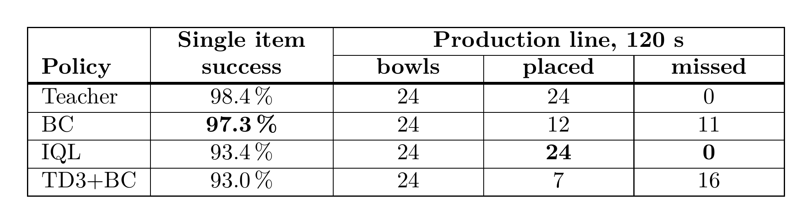
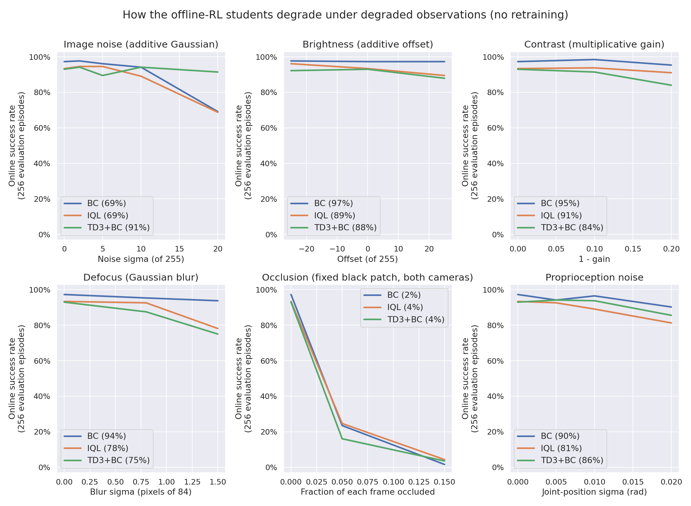

# Stage 2.1 · offline RL from the camera shards

Train a **deployable student** on the shards recorded in stage 1, with no simulator in the loop except for
evaluation. **BC**, **IQL** and **TD3+BC** share one runner, one set of networks, one data mix and one
evaluation protocol, so the only thing that differs between rows of the results table is the objective.

## Protocol

| | |
|---|---|
| **Data** | `expert_v3c` (1 M frames, ~1 M legal transitions). Tiers mix by rows per batch via `data.shards` / `data.proportions`. |
| **Student inputs** | both cameras (84×84×3 uint8, one frame each) plus `proprio`. No privileged state, no bowl pose. |
| **Networks** | one Nature-CNN encoder per camera (32/64/64, kernels 8/4/3, strides 4/2/1, 256-d) plus an MLP branch for the vector groups → fusion MLP `[512, 256]`. Separate encoders per head (actor, each Q, V). |
| **Budget** | 100,000 gradient steps, batch 256, Adam at `lr 3e-4`, grad-norm clip 10 |
| **Evaluation** | every 10,000 steps: 128 fresh camera envs, deterministic policy, each env's **first** finished episode scored. Byte-for-byte the protocol that scored the teacher, so the numbers compare directly. |
| **Reward** | scaled by 0.1 before the loss (BC ignores it) |

`tests/unit/test_offline_configs.py` asserts the shared block of every `config.yaml` here is identical, so
the protocol cannot drift between algorithms by accident.

Teacher reference under the same protocol: **0.984**. Evaluation noise at 128 episodes is ±0.019 near the
ceiling, so **differences under about 0.04 are not differences**.

## Run

    python pipeline/2_1_offline_rl/bc/train.py        # also: iql, td3_bc
    docker exec <container> pkill -TERM -f "kit/python/bin/python3.*train.py"   # stop, keeping a final checkpoint

One run at a time: each holds a 128-env camera evaluation env, and two Isaac jobs at once have OOM-killed
the host.

Useful overrides: `seed=`, `gradient_steps=`, `batch_size=`, `data.shards=[expert_v3c,medium_v3c]`,
`data.proportions=[...]`, `network.in_keys=[[pixels,overview_rgb],[pixels,wrist_rgb],proprio]`,
`eval.interval=`, `eval.num_envs=`, `checkpoint.interval=`, `optim.lr=`, any `loss.*` key of the algorithm,
`run.name=`, `logger.backend=null`.

Results land in `$FOOD_ROBOT_ARTIFACTS/students/<run>/`: `manifest.json` (git commit, config, per-shard
provenance, `eval_history`, `best_eval`), `checkpoints/<algo>_<step>.pt` with a sidecar `.json` carrying
that checkpoint's own evaluation and sha256, and the stdout stream `RUN_INFO` / `METRICS` / `EVAL` /
`CHECKPOINT` / `STOP_REASON`.

## Results: three algorithms, three seeds

`mean ± half the seed range`. "Late stability" is the standard deviation of the last five evaluations.

| Algorithm | Best | Final | Mean of last 5 | Steps to 0.90 | Late stability | Wall clock |
|---|---|---|---|---|---|---|
| **BC** | 0.979 ± 0.008 | 0.948 ± 0.031 | 0.944 ± 0.016 | **20 k ± 10 k** | 0.025 | **0.38 h** |
| **IQL** | **0.990 ± 0.012** | **0.953 ± 0.008** | **0.956 ± 0.011** | 27 k ± 15 k | 0.025 | 1.22 h |
| **TD3+BC** (`alpha 0.025`) | 0.958 ± 0.008 | 0.922 ± 0.027 | 0.919 ± 0.019 | 63 k ± 5 k | 0.036 | 0.83 h |
| TD3+BC at the paper's `alpha 2.5` | 0.219 | 0.109 | 0.102 | never | 0.090 | 0.83 h |

**BC and IQL are the same policy as far as this protocol can tell.** Every gap between them (0.005–0.012)
is smaller than both the seed spread and the evaluation noise, and their per-seed ranges overlap
completely, so IQL's nominal lead is not worth 3.2× the wall clock. The difference that *is* real separates
TD3+BC: steps to 0.90 is the one metric with non-overlapping ranges (BC 10–30 k, IQL 10–40 k, TD3+BC
60–70 k).

**What this really measured.** On zero-action-noise expert demonstrations there is nothing for a
value-based method to add. `expert_v3c` was recorded from a deterministic teacher, so every state appears
with exactly one action and `Q(s, ·)` has no counterfactual to fit: on a trained critic Q varies by ±40
across states and about **2** across actions. The algorithms then sort by how much they let that
action-blind Q move the policy — BC not at all, IQL only as a re-weighting of a cloning term, TD3+BC
through an explicit Q gradient that has to be turned down 100×. The open question is a dataset one, not an
algorithm one: whether action-noisy data lets these methods beat cloning instead of matching it.

### Does the student beat its teacher?

No. At 128 episodes IQL's best evaluation point reads 1.000, above the teacher's 0.984, which is why the
question needed a bigger sample. Re-evaluated at **1000 episodes** (teacher in one pass, students as two
pooled passes of 500 fresh camera envs):

| | Episodes | Successes | Success rate | 95% CI |
|---|---|---|---|---|
| Teacher | 1000 | 982 | 0.982 | [0.974, 0.990] |
| BC (best checkpoint, best seed) | 1000 | 983 | 0.983 | [0.975, 0.991] |
| IQL (best checkpoint, best seed) | 1000 | 947 | 0.947 | [0.933, 0.961] |

Teacher vs BC: z = −0.17, indistinguishable. Teacher vs IQL: **z = 4.23**, significantly worse, in the
opposite direction from the 128-episode reading. **BC, not IQL, is the one that matches its teacher**, at a
third of the training wall clock.

    python pipeline/2_1_offline_rl/evaluate.py checkpoint=<student.pt> num_envs=500 seed=0

### Proprioception, not vision, was the bottleneck

Earlier single-seed runs at a 150 k budget established which inputs were worth shipping. With **image
only**, BC reaches 0.820 and IQL 0.813 at their best checkpoints, and both oscillate in a 0.4–0.8 band all
through training. Adding `proprio`, the 34 numbers a real controller already knows, takes BC to 0.984 and
IQL to 0.992 and removes most of the oscillation. That single change closes essentially the whole gap to
the teacher, which is why every run in the grid above uses image + proprio.

Runs that consumed the simulator-only `privileged` group reached no higher and were dropped: that
information has no real-robot equivalent, so it cannot inform a decision about what to ship. `belt` (the
bowl's pose) is the one further group a real cell might plausibly supply, from a belt encoder or a fixed
overhead camera, and is untested.

### Episodic success does not predict throughput

Running the same checkpoints on a continuous line — bowls arriving for 120 s, scripted return home between
placements — inverts the ranking.

BC has the best single-item score and places half as many items as IQL, which matches the teacher exactly.
The cause is dropped items: BC loses 9 food items in two minutes and TD3+BC 7, against IQL's 1, and each
drop costs the bowl plus the recovery time. Execution speed is not the difference; per episode all three
take about 117 steps. Why cloning-shaped policies drop so much more often here is unexplained — their
single-item drop rates differ in the same direction (BC 2.7%, IQL 2.0%) but far less than the line
amplifies them.

    python pipeline/0_state_teacher/demo.py checkpoint=<any.pt> seconds=120 [video=false]

Without the scripted homing every student collapses after one or two cycles (BC 1 placed, IQL 7, TD3+BC 1
of the same 24 bowls): the state after a placement is one no episodic training ever visited. Multi-cycle
training is the fix and has not been done.

### Robustness to degraded observations

The obvious explanation for the inversion is that IQL generalises and BC is a sharp fit to the training
distribution. It is wrong. Across 17 conditions at 256 episodes each — image noise, brightness, contrast,
defocus, occlusion, proprio noise — **BC is the most robust student in four of the six families**, tied in
the fifth, and tied with IQL in the sixth. Sensor degradation cannot be what flips the two in production.

Two findings with deployment consequences: occluding 5% of both camera frames takes every student from
~0.95 to 0.15–0.26, and the three objectives fail in genuinely different ways (TD3+BC is nearly immune to
pixel noise and the weakest under blur, the cloning-shaped policies the reverse). Full sweep, all
conditions and the statistics: [`docs/experiments/offline_rl/robustness.md`](../../docs/experiments/offline_rl/robustness.md).

    python pipeline/2_1_offline_rl/robustness.py checkpoint=<student.pt> num_envs=256

## Hyperparameters that are not the published defaults

Defaults come from TorchRL's `sota-implementations` configs. Two deviations are load-bearing.

**TD3+BC `alpha 0.025`, not the paper's 2.5.** `alpha` sets the Q-vs-BC balance (the loss scales the Q term
by `alpha / mean|Q|`). At 2.5 the policy gets 0.000 success for 60 k steps. The cause is the data, not the
loss: with one action per state the Q gradient is noise, yet the normalisation makes it exactly as large as
the BC gradient. Sweep at 20 k steps:

| Data | `alpha` | 5 k | 10 k | 15 k | 20 k |
|---|---|---|---|---|---|
| `expert_v3c` | 2.5 (paper) | 0.000 | 0.000 | 0.000 | 0.000 |
| `expert_v3c` | 0.25 | 0.016 | 0.102 | 0.227 | 0.227 |
| `expert_v3c` | **0.025** | **0.680** | **0.719** | 0.617 | 0.648 |
| action-noisy data (`noise_sigma 0.2`) | 2.5 | 0.000 | 0.000 | 0.359 | 0.242 |

Both knobs move the same way, which is the signature of a missing counterfactual in the data rather than a
misconfigured loss. **On a dataset with action noise, `alpha` should go back up towards 2.5.**

**`loss_function smooth_l1` rather than `l2`** for every value-based algorithm: `l2` needs about ten times
the gradient norm for the same fit at this reward scale.

TD3+BC also cannot use the shared stochastic actor — `TD3BCLoss` reads `action` straight out of it and adds
the smoothing noise itself — so it gets `make_deterministic_actor`. `tests/unit/test_offline.py` pins that,
because the wrong actor would train and checkpoint without error while making policy extraction
meaningless.

## Implementation notes

**Transitions.** A shard stores one row per env step, time-major, and does not store next observations, so
the successor of row `i` is row `i + successor_stride` (the collection's `num_envs`). `pickplace.offline`
precomputes the legal pairs once per shard as an index tensor: *ongoing* rows pair with `i + stride`,
*terminal* rows (terminated, not truncated) are kept with a masked bootstrap — dropping them would hide the
success bonus, which is 150 of a ~182 mean episode return — and *truncated* rows are dropped, since their
true next observation is not in the shard. No pair spans an episode boundary;
`tests/unit/test_offline.py` pins the exact legal index set on a synthetic shard.

**Tier mixing** is a fixed number of rows per shard per batch (largest-remainder split by
`data.proportions`), concatenated. Not `ReplayBufferEnsemble`, because a shard's legal rows are a
precomputed subset *and* the successor has to be gathered at `+stride`, which no stock sampler expresses.

## Adding an algorithm

Create `<algo>/{train.py,utils.py,config.yaml}` next to the existing ones. `utils.py` exposes
`make_algo(cfg, obs_shapes, obs_keys, action_dim, device)` returning an object with `policy`, `update(batch)`
and `state_dict()`; `train.py` loads `../runner.py` by path and calls `train(cfg, make_algo, "<algo>")`. Copy
the shared block of a neighbouring `config.yaml` unchanged, or `tests/unit/test_offline_configs.py` fails.
