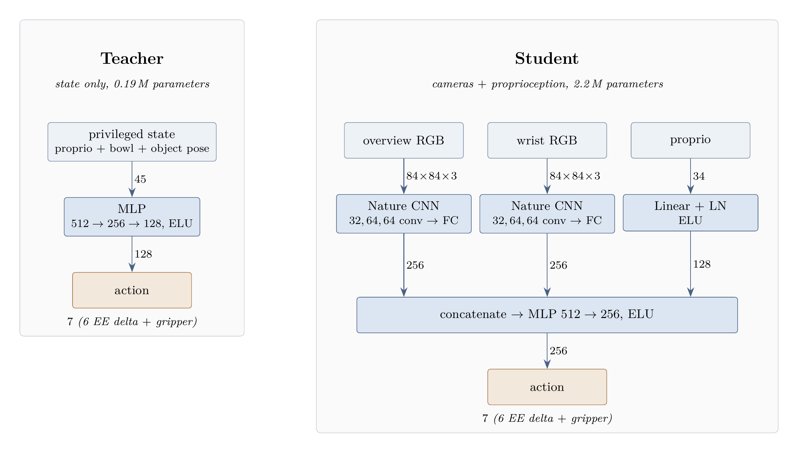

# Training pipeline

A staged route from a fast simulator-only teacher to a camera-based student. Each stage reads the previous
stage's artifacts by path and writes its own with a manifest, so any stage can be re-run, swapped or branched.
The online baselines in `sota-implementations/` are unaffected.

| Stage | Folder | Consumes | Produces |
|---|---|---|---|
| 0 · state teacher | `0_state_teacher/` | env config + reward set | checkpoints every 10 M frames + final, each with a manifest and (background) deterministic evaluation and video |
| 1 · collect data | `1_collect_data/` | one teacher checkpoint + frames + noise σ + seed | one dataset shard (camera + state + actions + reward terms) with a manifest |
| 2.1 · offline RL | `2_1_offline_rl/{bc,iql,td3_bc}/` | shards + mixing proportions + a reward set to relabel with | student checkpoints, online simulator evaluation |

## Networks

The teacher reads a 45-dimensional state vector; the student reads the same proprioception plus two 84 px
cameras and has to find the item and the bowl in the pixels. Only the actor is deployed: 0.19 M parameters
for the teacher, 2.2 M for the student, of which 79 % are the two camera encoders. Algorithms that learn a
value function train further networks of the same shape (PPO one critic, IQL three), which affects training
cost only.

## Artifacts

Artifacts live outside the repository under `$FOOD_ROBOT_ARTIFACTS` (default `~/food-robot-artifacts`):
`teachers/`, `shards/` and `students/`. `docker/run.sh` mounts that directory at `/workspace/artifacts` and
sets the variable. Every artifact carries a JSON manifest with the git commit (set `FOOD_ROBOT_GIT_COMMIT`
when running from a checkout without `.git`), the resolved config and its own summary.

## Rewards

The environment exposes every reward term, unweighted, as `("next", "reward_terms")` in the order of
`pickplace.rewards.REWARD_TERMS`; TorchRL's `LineariseRewards` turns it into the scalar `reward` with the weights
of a reward set (`pickplace/reward_sets/<name>.yaml`). Select one with `env.reward_set=<name>` and override
single weights with `+env.reward_weights.<term>=<value>`. Because datasets store the vector, later stages can
relabel the same data under any reward set. The reward is simulator-only training scaffolding: only the inputs
of the deployed student (cameras and robot state) must exist on a real robot.
